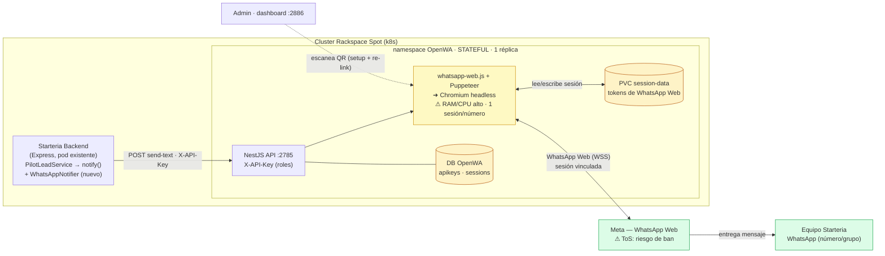

# ADR-017: Notificación de pilot lead por WhatsApp vía OpenWA (self-hosted)

## Status
Proposed — 2026-05-31 · **Backlog** (Milestone "WhatsApp lead notification")

## Date
2026-05-31

## Context

El equipo ya recibe un aviso por **correo** cuando se captura un pilot lead
(ADR-015 §4, implementado en PR #60: `EmailNotifier` sobre SMTP). El correo
resuelve la trazabilidad pero tiene **baja inmediatez** — un lead de piloto es
caliente y conviene contactarlo rápido, y el equipo vive más en WhatsApp que en
el inbox.

Se evaluó añadir **WhatsApp** como canal de notificación. La abstracción ya
existe: `PilotLeadNotifier` es una interfaz inyectada en `PilotLeadService`, así
que agregar un canal NO toca el dominio — solo se suma un notifier (o un
multi-notifier que haga fan-out a correo **+** WhatsApp).

La decisión de producto (turno 2026-05-31) es: **usar OpenWA**
(`github.com/rmyndharis/OpenWA`), un gateway de WhatsApp self-hosted open source
(MIT), en vez de la WhatsApp Business Cloud API oficial de Meta.

**Análisis de OpenWA (v0.1.6):**
- Stack: NestJS 11 + TypeScript + TypeORM (SQLite/PostgreSQL), Docker-native.
- **Engine: `whatsapp-web.js@1.26.1-alpha.3` — NO oficial.** Automatiza WhatsApp
  Web vía Puppeteer + **Chromium headless** y un número de teléfono real
  vinculado por **QR**. No es la Cloud API de Meta.
- API REST en `:2785`, dashboard en `:2886`, auth por **API Key con roles**
  (`API_MASTER_KEY`), webhooks con HMAC.
- Envío de texto: `POST /api/sessions/{sessionId}/messages/send-text`
  (header `X-API-Key`, body `{ chatId: "51999888777@c.us", text }`).

**Decision question:** ¿Cómo integramos la notificación por WhatsApp con OpenWA
self-hosted, asumiendo conscientemente los costes (servicio stateful con
Chromium + PVC + sesión QR) y el riesgo de ToS del engine no oficial?

## Deployment (vista rápida)

> Fuente editable: `docs/diagrams/adr-017-openwa-whatsapp-deployment.drawio`.
> Vista inline (Mermaid) para entender el costo stateful — Chromium + PVC + sesión:

**Por qué es stateful:** la sesión de WhatsApp vive en el **PVC**; sin él, cada
reinicio del pod exige **re-escanear el QR**. El Deployment es de **1 réplica**
(una sesión por número, no escala). Chromium headless consume RAM/CPU notable. Si
OpenWA cae, el `WhatsAppNotifier` degrada y el **correo (PR #60) sigue como canal
primario**.

## Decision

1. **Usar OpenWA self-hosted como gateway de WhatsApp**, desplegado en el clúster
   Rackspace Spot en un **namespace dedicado** y como **servicio stateful**
   (Deployment de **1 réplica**, NO escalable horizontalmente — una sesión de
   WhatsApp Web por número).
2. **Persistir la sesión en un PVC** (`SESSION_DATA_PATH`). El PV conserva los
   tokens de WhatsApp Web entre reinicios; sin él, cada reinicio exige
   **re-escanear el QR** (operación manual vía dashboard `:2886`).
3. **Número dedicado**, nunca el personal de un miembro del equipo, para acotar
   el blast radius de un eventual ban.
4. **Integración como segundo notifier**, no reemplazo: se introduce un
   `WhatsAppNotifier` (HTTP → OpenWA `send-text`) y un `CompositePilotLeadNotifier`
   que hace fan-out. El **correo (PR #60) sigue siendo el canal primario**;
   WhatsApp es aditivo. Si OpenWA no responde, el WhatsApp notifier **degrada con
   gracia** (loguea sin PII, no tumba la captura) — mismo contrato que el email.
5. **Destino configurable** por env (`WHATSAPP_NOTIFY_CHAT_ID`): número
   `…@c.us` o grupo del equipo `…@g.us`. API key de OpenVA en secret
   (`OPENWA_API_KEY`, `OPENWA_BASE_URL`).
6. **Mensaje accionable con PII de contacto** (mismo criterio consentido que el
   correo, ADR-015 / PR #60); el AuditLog y los logs **siguen sin PII**.
7. **Dejar en backlog**: se documenta y planifica (PRD-004 + issues del
   milestone), pero **no se implementa hasta priorización**. El correo cubre la
   necesidad mínima mientras tanto.

## Consequences

**Positivas**
- Notificación inmediata por el canal que el equipo realmente usa → contacto más
  rápido del lead caliente.
- Sin costo por mensaje ni verificación de Meta Business (vs. Cloud API oficial).
- Control total / sin vendor lock-in; reutilizable para futuros usos (recordatorios
  de piloto, confirmaciones).
- Integración de bajo acoplamiento: la interfaz `PilotLeadNotifier` ya soporta
  fan-out; el dominio no cambia.

**Negativas / costes**
- **Servicio stateful nuevo** en el clúster: Chromium headless (alto RAM/CPU),
  PVC para la sesión, Deployment de 1 réplica (no HA real). Aumenta la superficie
  de operación de forma notable para lo que hoy es "1 lead → 1 correo".
- **Riesgo de ToS / ban**: `whatsapp-web.js` no es oficial; Meta puede banear el
  número. Mitigado (no eliminado) usando un número dedicado y volumen bajo/interno.
- **Fragilidad del engine**: versión alpha; se rompe cuando WhatsApp Web cambia.
  La sesión puede caerse y requerir re-escaneo de QR manual.
- **Operación manual de bootstrap**: alguien debe escanear el QR al desplegar y
  re-vincular si la sesión expira.

## Compliance / privacy
- Mismo régimen que ADR-015: consentimiento previo (US-005), PII de contacto solo
  en el cuerpo del mensaje al equipo (propósito consentido), **nunca en logs ni
  AuditLog en claro**.
- La API key de OpenWA y la `OPENWA_BASE_URL` van en `starteria-backend-secrets`
  (sincronizado por `cd.yml`), nunca en código.
- Tráfico backend↔OpenWA **intra-clúster** (no expuesto a internet).

## Alternatives considered
- **WhatsApp Business Cloud API (oficial, Meta)** — rechazada *para esta fase*:
  exige verificación de Meta Business, **plantillas aprobadas** para mensajes
  iniciados por el negocio y costo por mensaje; mayor fricción de setup para un
  aviso interno de bajo volumen. **Se reconsiderará** cuando se mensajee a
  clientes desde el dominio de marca (igual que la nota Resend/SendGrid del email).
- **Solo correo (status quo, PR #60)** — válido y suficiente hoy; se mantiene como
  primario. Este ADR es aditivo, no lo descarta.
- **Proveedor SaaS de WhatsApp (Twilio/360dialog)** — rechazada: reintroduce
  costo y dependencia externa que justamente OpenWA evita; contradice la decisión
  de producto de self-hosting.

## Related
- ADR-015 (captura de pilot lead — define el notifier y el régimen de PII)
- PR #60 / issue #54 (EmailNotifier — canal primario, patrón de degradación)
- PRD-004 (WhatsApp lead notification — este trabajo, en backlog)
- Diagrama de deployment: `docs/diagrams/adr-017-openwa-whatsapp-deployment.drawio`
- `project_multiagent_architecture` (mención previa de bridge WSP/Telegram)
