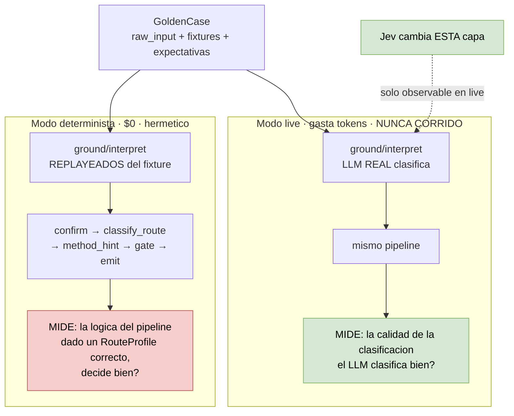

# 00 — Medición: qué existe, qué se corrigió y qué sigue faltando

> **Actualización de auditoría — 2026-09-20:** consultar [Jev y dataset v2](10-evaluacion-routing-dataset-v2.md).
> Ya hay 36 casos y un brazo Jev experimental. La revisión corrige la atribución de fallos al
> umbral high, detecta diferencias de preparación de estado entre brazos y distingue resultados
> históricos de conclusiones aún no verificadas. Las propuestas siguientes no son decisiones aprobadas.

**Prerequisito de los ocho casos.** · **Fecha:** 2026-09-19
**Código:** `ai-service/harness/eval/` + `harness/llm.py` + `services/` · **Estado:** E1–E3, E6–E9 implementados · **primera corrida live: 2026-09-20**

---

## Resumen ejecutivo

La suite de medición **ya existía** y estaba mejor construida de lo que este análisis asumió
al principio: A/B de dos brazos, modo determinista hermético, seis métricas, scorecard en
markdown. Agregar un `jev_arm` es la extensión natural de un diseño que ya lo previó.

Al auditarla y correrla aparecieron tres defectos que producían números engañosos. **Los tres
están corregidos** (E1–E3, abajo). Pero el problema de fondo sigue en pie y ninguna mejora del
instrumento lo arregla:

> **El brazo `harness` saca 1.0 en cuatro de seis métricas, 12 de 12 casos.** En modo
> determinista la suite **no puede medir una mejora**, solo regresiones. Y la métrica central
> para Jev se calcula sobre **seis casos**.

## La corrida actual

```
# Harness A/B scorecard (deterministic, n=12)

| Metric                           | Baseline | Harness | Δ         |
|----------------------------------|---------:|--------:|----------:|
| routing_precision                |   0.1667 |     1.0 | ▲ +0.8333 |
| gate_compliance                  |      0.5 |     1.0 | ▲ +0.5    |
| hallucination_rate               |      0.0 |     0.0 | ＝ +0.0   |
| classification_accuracy (n=6)    |      0.0 |     1.0 | ▲ +1.0    |
| confidence_calibration (n=0/6)   |      n/a |     1.0 | n/a       |
| next_action_quality              |      5.9 |    10.0 | ▲ +4.1    |

## Classification, per dimension (n=6 route cases)

| Dimension      | Baseline | Harness | Δ      |
|----------------|---------:|--------:|-------:|
| challenge_type |      0.0 |     1.0 | ▲ +1.0 |
| depth          |      0.0 |     1.0 | ▲ +1.0 |
| route          |      0.0 |     1.0 | ▲ +1.0 |
| step           |      0.0 |     1.0 | ▲ +1.0 |

## Latency (harness_overhead — pipeline only — NO LLM round-trip.)

| Measure   | Baseline | Harness |
|-----------|---------:|--------:|
| p50 ms    |    0.193 |   0.176 |
| max ms    |    1.066 | 251.807 |
| LLM calls |        0 |       0 |

> No LLM call was made in this run, so it carries no cost signal.
```

Cómo leer la latencia: el `max` de 251 ms del harness es **arranque en frío** — construcción
del registry y carga de config en el primer caso. El p50 (~0,18 ms) es el overhead en régimen,
y **se solapa con el del baseline**: a esa escala, con doce muestras, la diferencia entre
ambos brazos es ruido. El número sirve como piso ("el pipeline no cuesta nada"), no como
comparación.

## Por qué el 1.0 es tautológico

En modo determinista, `runner.py:43-47` construye los mocks así:

```python
def _mocks_for(case: GoldenCase):
    return {
        "ground":    lambda: GroundedFieldList(fields=[GroundedField(**f) for f in case.ground]),
        "interpret": lambda: RouteProfile(**case.interpret),
    }
```

`case.interpret` es un fixture escrito a mano **dentro del propio dataset**, autorado para
coincidir con `case.expected_*`. El brazo harness **no clasifica**: lee la respuesta correcta
y la devuelve. No puede fallar.

No es un defecto — es una elección correcta, pero mide otra cosa de la que necesitamos:



**Consecuencia:** Jev cambia exactamente la capa que el modo determinista stubea. El A/B de
Jev **solo existe en modo live**, y el modo live nunca se corrió — está detrás de
`HARNESS_EVAL_LIVE=1` más una API key real (`runner.py`), y `out/` está gitignored, así que no
hay resultados históricos en el repo.

## Lo que la suite sí mide bien

El modo determinista prueba algo real: que el pipeline convierte un `RouteProfile` correcto en
la decisión correcta, incluyendo gates, escalera de riesgo y términos prohibidos. Es
regresión-testing legítimo y corre a $0.

---

## Los seis huecos — estado

| # | Hueco | Estado |
|---|---|---|
| 1 | Saturación en determinista | **ABIERTO** — bloqueante, requiere modo live |
| 2 | n=12, y n=6 para la métrica central | **ABIERTO** — bloqueante, trabajo de producto |
| 3 | `classification_accuracy` colapsa 4 dimensiones | ✅ resuelto en **E1** |
| 4 | `confidence_calibration` producía un delta falso | ✅ resuelto en **E2** |
| 5 | No mide latencia ni costo | ✅ latencia en **E3** · tokens en **E6** · precio sigue abierto |
| 6 | Cobertura limitada al harness | **ABIERTO** |

### 1. Saturación — *bloqueante, abierto*

Descrito arriba. Sin corridas en modo live no hay A/B posible para los casos 01 y 02.
**Cuesta tokens y hay que presupuestarlo**, a diferencia de todo lo demás.

### 2. n=6 para la métrica que importa — *bloqueante, abierto*

| `expected_kind` | Casos |
|---|---|
| `route` | **6** |
| `confirm` | 5 |
| `escalate` | 1 |

`classification_correct` devuelve `None` para `confirm` y `escalate`. Un solo caso mueve el
número **16,7 puntos**. Ningún refinamiento del instrumento arregla eso: hay que etiquetar
más casos, y es trabajo de producto.

Gracias a E1, ese `n=6` ahora está **impreso en el scorecard**, no escondido en el código.

### 6. Cobertura limitada al harness — *abierto*

Los casos 02, 03, 05, 06, 07 y 08 tocan código fuera de `harness/`. `initial_reviewer` y
`field_refiner` no tienen eval. Las tres capacidades nuevas (05, 06, 08) **no tienen "antes"
por definición**: para ésas el criterio no es *"¿mejoró?"* sino *"¿alcanza el umbral?"*.

Para el caso 05 hay un punto de partida: el dataset ya incluye un caso llamado
**`solucion-disfrazada`**. Uno. Hacen falta varias decenas.

---

## Lo implementado

### E1 — Acuerdo por campo

`classification_correct` hacía `all(checks)` sobre cuatro dimensiones: una mejora en `step`
con una regresión en `route` se veía plana. Ahora hay `classification_by_field()`, y el
agregado estricto se deriva de él.

- Tabla nueva **Classification, per dimension** con el `n` en el encabezado.
- `CLASSIFICATION_FIELDS` es la única tabla a tocar para puntuar una dimensión más. Para el
  caso 01 faltan `intent`, `unit`, `unit_status` y `uncertainty` — pero eso depende de que el
  dataset declare expectativas, que es E4.

**Hallazgo:** `GoldenCase.expected_horizon` estaba declarado en el schema, **ningún caso lo
poblaba y ninguna métrica lo leía**. Schema muerto. Quedó cableado: en cuanto un caso lo setee,
la fila aparece sola.

### E2 — `None` significa "no medible", no cero

`_mean([])` devolvía `0.0`. El brazo baseline nunca setea `confidence`, así que el filtro de
calibración quedaba vacío y la métrica imprimía `0.0` — indistinguible de una calibración
genuinamente mala, **y fabricaba un `Δ +1.0` que no existía**.

- `_mean` devuelve `None` para muestra vacía; el docstring de `scorecard` fija la convención
  de que los callers no lo traten como cero.
- `deltas` exige ambos lados medibles, si no es `None`.
- Denominadores impresos: `classification_accuracy (n=6)`, `confidence_calibration (n=0/6)`.
  Un 1.0 sobre dos casos y un 1.0 sobre cincuenta dejan de leerse igual.

### E3 — Latencia con scope declarado

- `ArmResult` gana `latency_ms`, `llm_calls` y `latency_scope`
  (`harness_overhead` | `end_to_end` | `mixed`).
- El scope está **en el título de la sección**, no en una nota al pie: un número determinista
  no puede confundirse con uno live. Si los brazos discrepan, el scope pasa a `mixed` y el
  encabezado lo dice.
- Cuando no hubo llamada LLM, el markdown **declara la ausencia de señal de costo** en vez de
  imprimir un `$0.00` citable fuera de contexto.

**Tres cosas que aparecieron al implementar:**

**`llm_used` mentía, y es código de producción.** `harness/driver.py` lo calculaba como
`current in (GROUND, INTERPRET)` — eso es *"esta etapa es de tipo LLM"*, no *"se llamó a un
LLM"*. En determinista reportaba `True` con los mocks puestos. Corregido con `ctx.mock_for()`,
que ya existía. **Es el único cambio fuera de `harness/eval/` y merece revisión.**

**`StageTrace.duration_ms` es `int` y trunca.** Cada etapa mockeada tarda menos de 1 ms, así
que la suma per-stage daba 0. No se tocó el schema de producción; se mide con `perf_counter`
en el runner, con el comentario explicando por qué no se usa el campo existente.

**`deltas` era frágil y se rompió dos veces** — primero con un dict (E1), después con un string
(E3). Enumerar excepciones era el problema; ahora solo resta lo numérico en ambos lados.

### E6 — Contabilidad de tokens

`.with_structured_output()` descartaba el `usage_metadata`. Ahora se pide con
`include_raw=True` y los tokens viajan hasta el scorecard.

**El canal es un `contextvar`, no un parámetro.** `stage_structured_call` sigue devolviendo el
modelo parseado y conserva su firma: sus dos callers no cambian, y el doble que lo monkeypatchea
en `test_harness_integration` sigue funcionando sin tocarse. Obligar a cada test double a
crecer un parámetro de telemetría habría sido el diseño equivocado.

- `TokenUsage(model_id, input_tokens, output_tokens)` y el context manager `collect_usage()`.
- `StageTrace` gana `tokens_in` / `tokens_out`; el driver envuelve cada etapa y los deposita.
- `ArmResult` y el scorecard los agregan; el markdown los muestra junto a la latencia.

**El riesgo que casi pasa desapercibido:** con `include_raw=True` los errores de parseo **dejan
de levantar excepción** y vuelven en `parsing_error`. El bucle de 2 intentos captura
excepciones, así que sin manejarlo explícitamente **el retry de truncación habría muerto en
silencio** — el mismo retry que existe porque el proveedor trunca JSON. Hay un test dedicado a
eso (`test_parsing_error_still_retries`).

Dos decisiones de conteo que importan:

- **Los reintentos se suman.** Una respuesta truncada igual se facturó; un costo que esconde
  reintentos subestima lo que cuesta una corrida.
- **Sin `usage_metadata` el valor es `None`, no 0.** "Gratis" y "no reportado" son afirmaciones
  distintas, y el scorecard las renderiza distinto.

**Verificación:** 8 tests herméticos nuevos (`tests/test_harness_llm_usage.py`) que ejercitan
el **camino live** — desempaquetado del envelope, retry por `parsing_error`, captura de uso,
y el end-to-end driver → `StageTrace`. La corrida determinista no cubre nada de esto porque
nunca llega a la rama de red.

> **Lo que todavía no se sabe:** si OpenRouter devuelve `usage_metadata` para el modelo de
> etapa configurado. El camino está cableado y probado contra un chain falso, pero **nunca se
> observó contra el proveedor real**. Si no lo reporta, los tokens saldrán `n/a` en vivo — y el
> scorecard lo dirá explícitamente en vez de imprimir ceros.

### E8 — Precio por modelo

Tokens ≠ costo. La conversión exigía una tabla de precios, y había **dos que no se conocían
entre sí**: las constantes de `services/model_router.py` y el dict `OPENROUTER_MODEL_PRICING`
de `agents/pdf_extractor/extractor.py`.

Peor: `estimate_cost_usd(_agent_id, ...)` **ignoraba el `agent_id`** y cobraba todo a tarifa
qwen ($0.25/$1.50), mientras la mitad de los agentes corre deepseek. No era un riesgo: era un
bug vivo alimentando `check_project_daily_budget()`.

`MODEL_PRICING` ahora tiene siete modelos, cada uno con su procedencia — hay un test que
falla si una entrada se queda sin fuente:

| Modelo | In | Out | Estado |
|---|---:|---:|---|
| `qwen/qwen3.6-flash` | $0.25 | $1.50 | en uso |
| `deepseek/deepseek-chat` | $0.14 | $0.28 | en uso |
| `deepseek/deepseek-v4-flash` | — | — | en uso · **$0.0004/call medido** |
| `prism-ml/ternary-bonsai-2-27b` | $0.075 | $0.50 | candidato |
| `z-ai/glm-5.3-flashx` | $0.37 | $1.25 | candidato |
| `google/gemini-3.8-flash` | $0.75 | $3.75 | candidato · lista $1.50/$7.50 |
| `z-ai/glm-5.3` | $0.8442 | $2.653 | candidato · lista $1.407/$4.422 |

Tres decisiones:

- **Las promociones guardan su precio de lista.** Un test exige ambos valores y que el
  `source` lo declare. Cuando la promo termine, el número real ya está ahí.
- **`deepseek-v4-flash` se cotiza por llamada, no por token** — es lo que realmente se midió
  (`agents/initial_reviewer.py:34-37`, benchmark 2026-07-12). El `basis` devuelve
  `"per_call"` y un test afirma que 10 tokens y 100.000 cuestan lo mismo: aproximación de
  orden de magnitud, declarada como tal en vez de fingir una tarifa.
- **Precio desconocido devuelve `None`.** Misma convención que E2 y E6.

**El anti-drift.** `AGENT_MODELS` mapea `agent_id → modelo`, espejando constantes que viven
en nueve archivos de agentes. `tests/test_model_pricing_registry.py` **importa los módulos
reales y compara**; para el harness lee `methodology.yaml`. Si alguien cambia el modelo de un
agente, el test falla nombrando el archivo.

**Decisión de comportamiento que conviene revisar:** ante un modelo sin precio, `CostTracker`
**falla abierto** — no bloquea, suma $0 al presupuesto e incrementa `unpriced_call_count()`
para que el subconteo sea visible. Es seguro para el producto e inseguro para el presupuesto.
Hoy ningún modelo en uso cae en ese caso, así que el contador debería quedarse en cero.

**Verificación:** 36 tests nuevos. `343 passed`, `ruff: All checks passed`.

### E9 — Los tokens llegan al presupuesto

E6 capturó tokens en el harness; E8 arregló la tarifa. Faltaba que los números llegaran a
`CostTracker`, y por dos caminos distintos no llegaban.

**El camino deepagents.** `agents/orchestrator.py` registraba
`input_tokens=0, output_tokens=0` con la nota *"deepagents does not expose token counts
directly"*. **La nota estaba desactualizada:** cada `AIMessage` lleva `usage_metadata`.

Pero barrer `result["messages"]` habría sido peor que el bug. La invocación usa
`config={"configurable": {"thread_id": project_id}}`, así que el estado devuelto arrastra la
**conversación entera**, no el turno actual: sumarla re-factura todos los turnos previos en
cada request. Por eso `services/usage_collector.py` es un `BaseCallbackHandler` — observa
únicamente las llamadas hechas dentro de *esa* invocación.

Es el contraparte de `harness.llm.collect_usage()`: mismo problema, mecanismo distinto porque
el punto de intercepción es distinto.

**El camino del harness.** `invoke_harnessed` en `confirm`/`escalate` devolvía `tokensUsed=0`
y **nunca llamaba a `record_usage`**. Los tokens que E6 deposita en `StageTrace` morían ahí.
Ahora se registran, en una llamada aparte de la del step agent — distinto modelo, distinto
costo, contabilidad separada.

**Una decisión de conteo:** `calls_without_usage` cuenta las completions que no reportaron
uso. Contribuyen 0, lo que **sub-cuenta el presupuesto**, y el contador existe para que eso
sea visible. `complete` es `False` también con cero llamadas: no haber visto nada no es
"todas reportaron".

**Verificación:** 9 tests nuevos (`tests/test_usage_collector.py`), incluido uno que prueba la
cadena completa —tokens colectados, precio de E8, acumulado en el presupuesto—. Dos de esos
tests necesitaron un stub duck-typed: `AIMessage` y `LLMResult` validan sus payloads con
pydantic, así que una usage parcial o malformada no se puede construir a través de ellos,
aunque una integración de proveedor sí puede entregarla en runtime. El handler usa `getattr`;
los tests prueban lo que el handler realmente ve.

`352 passed`, `ruff: All checks passed`.

> **Lo que sigue sin saberse:** si los proveedores detrás de deepagents reportan
> `usage_metadata` de forma consistente. El camino está probado contra dobles, nunca contra
> tráfico real. Si no reportan, `calls_without_usage` lo dirá en los logs en vez de que el
> presupuesto quede en cero en silencio.

### E7 + E5 — El brazo Jev, y la primera corrida live

`harness/jev.py` hace las 9 preguntas cerradas de `RouteProfile` contra el mismo state que
recibe el LLM, y ensambla el mismo contrato. `harness/eval/runner.py` gana `--mode jev`, que
compara **dos clasificadores live sobre el mismo `ground` de fixture** — aislando `interpret`
y nada más. `harness_arm(live=True)` no sirve para esto: corre `ground` live también, y
mezclaría calidad de extracción en una comparación de clasificación.

Dos decisiones para que el experimento sea interpretable:

- **`route` se pregunta, no se deriva.** Derivarlo es mejor diseño (ver [01](01-route-profile-interpret.md))
  pero es **otro cambio**. Juntar los dos en un brazo haría imposible atribuir el delta.
- **`rationale` y `conditions_that_would_change` se derivan de las respuestas.** Sin segunda
  llamada: qué disparó y a qué distancia quedó el segundo **es** la razón.

Y un hallazgo del propio diseño: `criteria` es obligatorio en un Choice, así que hubo que
**escribir las descripciones de `intent` y `unit` — que la metodología nunca definió**. El
prompt solo lista sus etiquetas. Hoy el LLM las infiere de la etiqueta sola; Jev obliga a
escribir lo que se quiere decir.

#### Resultados — 36 casos (23 `route`), dataset v2.0.0, 2026-09-20

**Esta es la corrida de referencia.** La de 12 casos que sigue más abajo quedó como registro
de por qué una muestra chica engaña.

| Métrica | LLM interpret | Jev interpret | Δ |
|---|---:|---:|---:|
| routing_precision | **0.9167** | 0.7222 | ▼ -0.195 |
| gate_compliance | **0.9167** | 0.6944 | ▼ -0.222 |
| classification_accuracy (n=23) | **0.6087** | 0.3913 | ▼ -0.217 |
| hallucination_rate (n=10) | 0.0 | 0.0 | ＝ |
| next_action_quality | **9.73** | 8.89 | ▼ -0.84 |
| **latencia p50** | 14.987 ms | **557 ms** | **26,9×** |
| **latencia max** | 30.653 ms | **823 ms** | **37×** |
| tokens in | 54.075 | 54.227 | ＝ |
| **tokens out** | 61.147 | **15.567** | **3,9×** |

#### El desglose por campo da vuelta la lectura

| Dimensión | LLM | Jev | Δ |
|---|---:|---:|---:|
| **`route` (n=23)** | **0.913** | **0.913** | **＝ EMPATE** |
| `horizon` (n=11) | 0.636 | **0.727** | ▲ +0.091 |
| `step` (n=23) | 0.913 | 0.870 | ▼ -0.043 |
| `challenge_type` (n=8) | 0.625 | 0.375 | ▼ -0.250 |
| `method_pack` (n=21) | 0.857 | 0.571 | ▼ -0.286 |
| `depth` (n=3) | 1.0 | 0.667 | ▼ -0.333 |

**Con n=6, Jev parecía 0,167 peor en `route`. Con n=23 empata exactamente.** Era el artefacto
de muestra chica, y se disolvió con datos.

Esto es lo que compró [E1](#e1--acuerdo-por-campo): sin el desglose, el número visible es
`classification_accuracy 0.609 vs 0.391` y la conclusión sería *"Jev clasifica mucho peor"*.
El agregado es un `AND` sobre todas las dimensiones declaradas, así que lo arrastran las de
denominador chico.

#### `step` y `method_pack` NO son evidencia independiente

`harness/stages/deterministic.py:146-147` es explícito:

```python
state.method_pack_id = target.method_pack
if rp is not None:
    rp.step = target.step   # the routing table's step is authoritative
```

Los deriva la tabla de ruteo (§10) del `RouteProfile`. **El `step` medido no es el que eligió
el clasificador** — es el que asignó la regla que hizo match. `method_pack` sale de la misma
regla.

Consecuencia al leer el scorecard: **el mismo error aparece en tres columnas**. La comparación
independiente son cuatro dimensiones — `route`, `challenge_type`, `depth`, `horizon` — y ahí
Jev **empata en `route`, gana en `horizon`**, y pierde en las dos de denominador chico (n=8 y
n=3).

#### El umbral: ahora es un hecho medido

```
Confianza ALTA (≠ escalaciones):   LLM 19/23 (83%)   ·   Jev 5/23 (22%)
Escalaciones reales de Jev (low):  11/23, de las cuales 9 innecesarias
```

El gate `ambiguous_classification` tiene `predicate: confidence_low`
(`methodology.yaml:63-66`): **dispara solo con `low`**. El corte operativo es entonces
`_CONFIDENCE_MEDIUM = 0.50` en `harness/jev.py`, no el `_CONFIDENCE_HIGH = 0.75` — esa
frontera controla high/medium y este gate no la mira.

Con ese corte, Jev escala **11 de 23 rutas**, y **9 de esas 11 no lo necesitaban**. Eso
—y no la clasificación— es lo que hunde `routing_precision` (0.917 → 0.722) y
`gate_compliance` (0.917 → 0.694).

Los 19/5 de la fila de calibración cuentan otra cosa: decisiones con confianza **alta**. No
son escalaciones.

#### Lo que no se movió con 3× más datos

Latencia 26,9× y tokens de salida 3,9× se sostuvieron entre la corrida de 12 y la de 36. Son
arquitectónicas, no estadísticas: Jev no genera la prosa del `rationale`, devuelve estructura.

---

#### Registro: la corrida de 12 casos, 2026-09-20

| Métrica | LLM interpret | Jev interpret | Δ |
|---|---:|---:|---:|
| routing_precision | **0.9167** | 0.75 | ▼ -0.167 |
| gate_compliance | **1.0** | 0.75 | ▼ -0.25 |
| classification_accuracy (n=6) | **0.6667** | 0.5 | ▼ -0.167 |
| · route | **0.8333** | 0.6667 | ▼ -0.167 |
| · step | **0.8333** | 0.6667 | ▼ -0.167 |
| · challenge_type | 0.5 | 0.5 | ＝ |
| · depth | 0.5 | 0.5 | ＝ |
| next_action_quality | **10.0** | 9.0 | ▼ -1.0 |
| confidence_calibration | 0.8333 **(n=6)** | 1.0 **(n=2)** | *ver abajo* |
| **latencia p50** | 16.689 ms | **548 ms** | **30×** |
| **latencia max** | 21.469 ms | **656 ms** | **33×** |
| tokens in | 17.485 | 17.836 | ＝ |
| **tokens out** | 19.658 | **5.209** | **3,8×** |

> ### ⚠️ Esta corrida quedó desactualizada — se conserva como lección
>
> Con n=6, `route` daba Jev 0,167 **por debajo** del LLM. Con n=23 **empatan exactamente**.
> La diferencia que parecía real era un caso moviendo 16,7 puntos.
>
> Se deja escrita porque es el argumento de E4 en su forma más concreta: **una muestra chica
> no da una respuesta débil, da una respuesta equivocada.**

#### Por qué falló Jev: no fue la clasificación, fue el umbral

Los tres fallos de Jev son **el mismo fallo**: esperaban `route`, dieron `confirm`.

| Caso | Ruta que Jev eligió | Resultado |
|---|---|---|
| `tarea-ligera` | `plan_coordinate` | `confirm` |
| `readiness-bajo` | `implement_handoff` | `confirm` |
| `dependencia-ti` | `plan_coordinate` | `confirm` |

`confirm` no es un error de clasificación: es el gate `ambiguous_classification`
(`methodology.yaml:63`) disparando. Y la causa está en el denominador de la calibración:

> **LLM: 6 de 6 decisiones con confianza alta. Jev: 2 de 6.**

El umbral `_CONFIDENCE_HIGH = 0.75` en `harness/jev.py` **se eligió sin ningún dato**. La
confianza calibrada de Jev sobre `route`/`unit` cae por debajo, el perfil sale `medium`, el
gate escala a un humano, y eso se contabiliza como fallo de ruteo.

Es exactamente la **decisión C** que [01](01-route-profile-interpret.md) dejó pendiente:
*"con probabilidades calibradas hay que fijar un corte numérico, y ese corte define cuántos
humanos se interrumpen"*. Acá está medido: **el corte actual interrumpe a un humano en 3 de
6 rutas que no lo necesitaban.**

**Lo que no se hizo, a propósito:** retocar el umbral hasta que Jev empate. Ajustar sobre los
mismos 6 casos es sobreajuste, no calibración — el número mejoraría y no significaría nada.
Calibrar ese corte es lo primero que habilita **E4**.

#### El `1.0` que no es una victoria

`confidence_calibration` marca Jev 1.0 contra LLM 0.833. El denominador es **n=2 contra n=6**:
el 1.0 de Jev sale de dos casos. Sin [E2](#e2--none-significa-no-medible-no-cero), esa fila
se habría leído como un triunfo. Fue exactamente para esto que E2 existe.

#### Lo que la corrida cerró

**La incógnita de E6 y E9 está resuelta: los proveedores sí reportan `usage_metadata`.** Los
dos brazos devolvieron tokens reales, ninguno `n/a`. Toda la contabilidad construida funciona
contra tráfico real, no solo contra dobles de test.

**Defecto menor detectado:** `UserWarning: Parameters {'extra_body'} should be specified
explicitly. Instead they were passed in as part of model_kwargs`. Es el `sort: "throughput"`
de `harness/llm.py`, pasado por una vía deprecada de LangChain. Conviene arreglarlo junto con
el cambio a modo `Exacto`.

**Verificación:** 33 tests herméticos nuevos (`tests/test_harness_jev.py`), incluidos el
ensamblado del contrato, el mapeo de confianza, la exclusión de `confirmed` del espacio de
respuestas, y que ambos brazos clasifican desde el mismo string. `415 passed`.

### Dos cosas que E8 no arregla

**Siguen existiendo dos tablas de precios.** `OPENROUTER_MODEL_PRICING` está en el `__all__`
del paquete `pdf_extractor`, o sea API pública. Sus números se copiaron a la tabla nueva y hay
referencia cruzada en ambos lados, pero unificarlas es un cambio con su propio radio.

~~**`orchestrator.py` registra uso con cero tokens.**~~ **Resuelto en E9**, arriba.

### Verificación

`307 tests passed` en ese momento (343 tras E8), `ruff: All checks passed`. Los dos fallos que reporta la suite completa
(`test_pdf_extractor_snapshot`, `test_cost_tracker`) son **preexistentes**: se verificó
stasheando los cambios y fallan igual en árbol limpio con `ModuleNotFoundError: No module
named 'scorer'`.

Nota operativa: `uv run pytest` levanta un entorno efímero **sin las dependencias del
proyecto**. Los tests se corren con
`uv run --with pytest --with pytest-asyncio pytest`. No se modificó `pyproject.toml`.

---

## Lo que falta

| # | Trabajo | Naturaleza | Bloquea a |
|---|---|---|---|
| **E4** | Ampliar el dataset | **Producto** — etiquetado manual | Casos 01, 02 |
| ~~E5~~ | ~~Primera corrida live~~ | ✅ **hecha** 2026-09-20 | — |
| ~~E6~~ | ~~Contabilidad de tokens (harness)~~ | ✅ **hecho** | — |
| ~~E8~~ | ~~Tabla de precios por modelo~~ | ✅ **hecho** | — |
| ~~E9~~ | ~~Tokens en el camino deepagents~~ | ✅ **hecho** | — |
| ~~E7~~ | ~~`jev_arm`~~ | ✅ **hecho** | — |
| **E10** | Calibrar el umbral de confianza | **Bloqueado por E4** | Caso 01 |

## Dataset v2.0.0 — 2026-09-20

El dataset pasó de **12 casos a 36**, y de **6 casos `route` a 23**. Eso es casi 4× en la
métrica que gobierna todo el análisis.

| `expected_kind` | Antes | Ahora |
|---|---:|---:|
| `route` | 6 | **23** |
| `confirm` | 5 | 11 |
| `escalate` | 1 | 2 |

Tres cambios que importan tanto como el volumen:

**Las advertencias ahora viajan con el número.** El scorecard imprime su propio alcance
(`Dataset: 2.0.0. Scope: fixture_conditional.`) y cuatro descargos sobre qué mide y qué no
cada métrica. Mejor que dejarlas en un documento aparte: un scorecard citado fuera de
contexto se lleva sus límites puestos.

**`next_action_quality` dejó de premiar la forma.** `graders.py` ahora exige acierto real
—ruta, gate, clasificación y cero hechos prohibidos— para dar `PASS`. Antes una ruta
equivocada bien redactada podía sacar 10, y en la corrida del brazo LLM eso infló el 10.0:
incluía el caso que erró.

**`expected_horizon` dejó de ser schema muerto.** En [E1](#e1--acuerdo-por-campo) quedó
registrado que el campo estaba declarado en `GoldenCase` pero ningún caso lo poblaba y
ninguna métrica lo leía. Ahora está en 11 casos, y la maquinaria genérica lo puntúa **sin
tocar código**: `CLASSIFICATION_FIELDS` ya lo contemplaba.

### Los denominadores siguen siendo desiguales

De los 23 casos `route`:

| Expectativa | Declarada en |
|---|---:|
| `expected_route` | **23/23** |
| `expected_step` | **23/23** |
| `expected_challenge_type` | 8/23 |
| `expected_depth` | **3/23** |

Esto explica el `0.5` que **ambos** clasificadores sacaron en `challenge_type` y `depth` en
la corrida de 12 casos: **no medía a los modelos, medía un denominador diminuto**. Con `depth`
declarado en 3 casos, un caso mueve 33 puntos — más frágil todavía que `route` con 6.

`route` y `step` ya tienen base suficiente para una lectura. Las otras dos dimensiones no, y
conviene no citarlas hasta que la tengan.

## La pregunta que bloquea todo

**¿Cuántos golden cases `route` se pueden etiquetar, y quién los etiqueta?**

Ya no es una advertencia teórica: la corrida del 2026-09-20 la demostró. Con seis casos
`route`, toda la diferencia medida entre el LLM y Jev **es un caso**, y no se puede separar
"Jev clasifica peor" de "mi umbral de confianza está mal puesto".

El instrumento está afilado y probado contra tráfico real. Lo único que falta es muestra.
