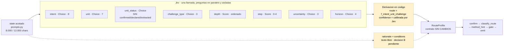

# 01 — `RouteProfile` en la etapa `interpret`

> **Actualización de auditoría — 2026-09-20:** consultar [Jev y dataset v2](10-evaluacion-routing-dataset-v2.md).
> Ya hay 36 casos y un brazo Jev experimental. La revisión corrige la atribución de fallos al
> umbral high, detecta diferencias de preparación de estado entre brazos y distingue resultados
> históricos de conclusiones aún no verificadas. Las propuestas siguientes no son decisiones aprobadas.

**Tier 1** · **Tipo:** reemplazo · **Estado actual:** existe y funciona · **Medido contra Jev: 2026-09-20** · **Gobernanza:** requiere enmienda a ADR-027

## Resumen ejecutivo

El pipeline del harness tiene ocho etapas y solo dos llaman al LLM: `ground` e `interpret`.
No son la misma clase de trabajo. `ground` extrae valores de texto libre — Jev no puede
hacer eso. `interpret` produce `RouteProfile`, cuyos **nueve de once campos son enums
cerrados**: clasificación pura, pagada hoy a precio de generación de texto.

Es el caso de mayor volumen de llamadas y también el de mayor riesgo, porque `RouteProfile`
alimenta todo lo que viene después.

## Cómo quedaría



En amarillo, lo que todavia no esta decidido: la derivacion de `route` y el destino del
`rationale`. El resto del pipeline no se entera del cambio.

## Dónde

| Qué | Anchor |
|---|---|
| Contrato de salida | `ai-service/harness/contracts.py:106` |
| Campos enum | `contracts.py:113-124` |
| Campos de prosa | `contracts.py:125-128` |
| Llamada LLM | `ai-service/harness/llm.py` → `stage_structured_call` |
| Armado del state | `ai-service/harness/prompts.py` (acotado a 8.000 / 12.000 chars) |
| Declaración de la etapa | `ai-service/harness/config/methodology.yaml:38-40` |

## Qué se le pregunta a Jev

| Campo | Línea | Espacio | Primitivo |
|---|---|---|---|
| `intent` | `:113` | 8 opciones | Choice |
| `unit` | `:114` | 7 opciones | Choice |
| `unit_status` | `:115` | EpistemicStatus **acotado** | Choice |
| `challenge_type` | `:118` | 3 opciones | Choice |
| `route` | `:119` | 6 opciones | *derivar en código* |
| `depth` | `:120` | light/standard/systemic — **ordenado** | Score |
| `uncertainty` | `:121` | 3 opciones | Choice |
| `horizon` | `:122` | H1/H2/H3/unconfirmed | Choice |
| `step` | `:123` | entero 0–4 — **ordenado** | Score |
| `confidence` | `:124` | low/medium/high/not_evaluable | *calibrada por Jev* |
| `rationale`, `conditions_that_would_change` | `:125-128` | texto libre | **solo LLM** |

El `state` que Jev necesita **ya lo construye `prompts.py`**, acotado y con provenance. No hay
trabajo nuevo de preparación de contexto.

## Qué mejora respecto de hoy

**1. Desaparece un modo de fallo.** `llm.py:93-101` envuelve la llamada en un bucle de dos
intentos, con el comentario explícito `# noqa: BLE001 — provider may truncate JSON; retry
once`. Ese retry es un parche a forzar estructura desde un modelo de texto. Jev no genera
texto, así que no tiene ese modo de fallo.

**2. `confidence` deja de ser autoreportado.** Hoy es un literal que el propio LLM se asigna
— el problema clásico de miscalibración: un modelo al que se le pregunta *"¿qué tan seguro
estás?"* no tiene nada contra qué anclar la respuesta. Y el campo **es load-bearing**:
alimenta el gate `ambiguous_classification` (`methodology.yaml:63`), que decide si se
interrumpe a un humano. Miscalibración acá significa, literalmente, humanos interrumpidos de
más o casos ruteados de menos.

**3. `route` se vuelve auditable.** Hoy el LLM lo elige holísticamente, lo que permite
combinaciones incoherentes con `intent`/`unit`/`challenge_type`. Derivarlo en código las
hace imposibles.

## Patrón de referencia

`jev-agent-skill-router` (*"routes agent skill selection through typed, confidence-aware
decisions so weak matches are declined instead of guessed"*) y `jev-cookbook` (*"sending
low-confidence answers to human review"*).

## Evaluación

| Dimensión | Valor |
|---|---|
| Esfuerzo | **Alto** — 9 preguntas + tabla de derivación de `route` + decisión sobre el rationale |
| Riesgo de regresión | **Alto** — alimenta `confirm`, `classify_route`, `method_hint`, `gate`, `emit` |
| Dependencias | Ninguna técnica. Bloqueado por tres decisiones de producto (abajo) |
| Medible con | `ai-service/harness/eval/` (`dataset.py`, `graders.py`, `metrics.py`, `runner.py`) |
| Costura de integración | El parámetro `mock=` de `stage_structured_call` ya permite sustituir el motor sin tocar `driver.py` ni `state_machine.py` |

## Criterio de aceptación propuesto

1. Acuerdo por campo ≥ el del LLM actual sobre el dataset existente de `harness/eval/`.
2. `confidence` medida con Brier score + curva de reliability. **Ya existe un baseline**:
   `harness/eval/metrics.py:91-93` calcula `confidence_calibration`, pero solo sobre el
   bucket `high` — es precisión-en-alta-confianza, no una curva. Con probabilidades
   continuas se puede medir de verdad; hay que extender la métrica, no crearla.
3. `RouteProfile` sigue siendo el contrato de salida, sin cambios. Las cinco etapas
   posteriores no se enteran.

## Tres decisiones pendientes (no son técnicas)

**A. La tabla de derivación de `route`.** Si sale de `intent × unit × challenge_type`,
alguien tiene que escribir esas reglas. Hoy el criterio del LLM es implícito y nadie lo
conoce. Explicitarlo hace el sistema auditable pero congela una semántica que hoy flota.
Es la decisión más pesada de este caso.

**B. `rationale` y `conditions_that_would_change`.** ¿Una llamada LLM barata adicional para
la prosa, o derivarlos de qué preguntas dispararon y con qué probabilidad? Lo segundo es más
barato y más auditable, pero cambia el tono de lo que ve el usuario.

**C. El umbral de `confidence`.** Hoy es `low/medium/high`. Con probabilidades calibradas hay
que fijar un corte numérico para disparar `ambiguous_classification`, y ese corte define
cuántos humanos se interrumpen.

> **Ya no es hipotético — está medido sobre 23 casos `route`.** El gate
> `ambiguous_classification` dispara solo con `confidence == "low"`
> (`methodology.yaml:63-66`), así que el corte operativo es `_CONFIDENCE_MEDIUM = 0.50`.
> Con él, Jev **escala 11 de 23 rutas y 9 no lo necesitaban** — aunque `route` empata con el
> LLM. Detalle en
> [00 — Medición](00-medicion.md#e7--e5--el-brazo-jev-y-la-primera-corrida-live).

## Lo medido — 36 casos (23 `route`), dataset v2.0.0, 2026-09-20

Corrida live comparando `interpret` con LLM contra `interpret` con Jev, ambos sobre el mismo
`ground` de fixture para aislar la variable.

### Las cuatro dimensiones que el clasificador realmente decide

| Dimensión | LLM | Jev | Δ |
|---|---:|---:|---:|
| **`route` (n=23)** | **0.913** | **0.913** | **＝ EMPATE** |
| `horizon` (n=11) | 0.636 | **0.727** | ▲ +0.091 |
| `challenge_type` (n=8) | 0.625 | 0.375 | ▼ -0.250 |
| `depth` (n=3) | 1.0 | 0.667 | ▼ -0.333 |

`step` y `method_pack` **no entran en esta lectura**: los deriva la tabla de ruteo del
`RouteProfile` (`deterministic.py:146-147`, con `rp.step = target.step` pisando lo que eligió
el clasificador). Contarlos junto a los anteriores hace que **el mismo error aparezca en tres
columnas**.

| Y lo que no cambió con 3× más datos | LLM | Jev | |
|---|---:|---:|---|
| latencia p50 | 14.987 ms | **557 ms** | **26,9×** |
| tokens out | 61.147 | **15.567** | **3,9×** |

> **La corrida anterior, con n=6, daba `route` 0,167 por debajo. Con n=23 empata exactamente.**
> No era una señal débil: era una respuesta equivocada.

### Decisión C: resuelta como diagnóstico, abierta como decisión

```
Escalaciones de Jev:  11 de 23 rutas  ·  9 de ellas innecesarias
```

El gate `ambiguous_classification` dispara solo con `low` (`methodology.yaml:63-66`), así que
el corte operativo es `_CONFIDENCE_MEDIUM = 0.50`. Eso —y no la clasificación— explica la
caída de `routing_precision` (0.917 → 0.722) y `gate_compliance` (0.917 → 0.694).

**El diagnóstico está cerrado. La decisión no**: dónde poner el corte es una pregunta de
producto —cuántas interrupciones a un humano se toleran para no perder una ruta— y no se
resuelve mirando el scorecard. Barrer el umbral sobre los mismos 23 casos que lo evalúan
sería sobreajuste.

Un hallazgo lateral del diseño del brazo: `criteria` es obligatorio en un Choice, así que hubo
que **escribir descripciones para `intent` y `unit`**, que `config/prompts/interpret.system.md`
nunca definió — solo lista sus etiquetas. Hoy el LLM las infiere de la etiqueta sola.

## Qué puede salir mal

**El invariante epistémico se puede violar desde afuera.** `harness/epistemic.py` garantiza
que `CONFIRMED` solo llega por acción humana autorizada, y `PROMOTABLE_FROM` solo admite
`INFERRED`, `SUGGESTED` y `CONFLICTING`. Un Choice sobre `EpistemicStatus` **debe excluir
`confirmed`, `declared` y `extracted` de su espacio de respuestas**. Si no, el modelo puede
emitir un estado que el harness protege internamente pero que entra por la puerta de atrás.

**El híbrido puede sumar latencia en vez de restarla.** Si se conserva la llamada LLM para el
rationale, quedan dos llamadas donde antes había una. El beneficio depende de resolver la
decisión B a favor de derivar.
