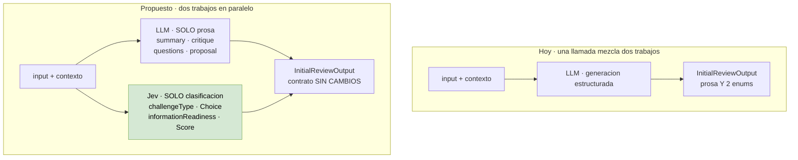

# 02 — Dos enums atrapados dentro de `InitialReviewOutput`

**Tier 1** · **Tipo:** reemplazo parcial · **Estado actual:** existe y funciona · **Gobernanza:** no contradice ADR-027

## Resumen ejecutivo

`InitialReviewOutput` es un contrato que **mezcla dos clases de trabajo en una sola llamada**:
genera prosa (resumen, crítica, propuesta mejorada, preguntas estratégicas) y además emite
dos clasificaciones sobre enums cerrados. Hoy se paga una llamada de generación completa para
obtener esas dos etiquetas.

Es el mismo defecto de diseño del caso [01](01-route-profile-interpret.md), en otro archivo y
con menos riesgo: acá la separación es limpia porque los campos son independientes entre sí.

## Antes y después

El criterio de aceptacion 3 sale de este dibujo: si las dos ramas corren en paralelo la
latencia deberia bajar. Si sube, el cambio no se justifica.

## Dónde

| Qué | Anchor |
|---|---|
| Contrato | `ai-service/agents/initial_reviewer.py:76` |
| `suggestedChallengeType` | `initial_reviewer.py:81` |
| `informationReadiness` | `initial_reviewer.py:85` |
| Presupuesto de contexto | `initial_reviewer.py:43-44` (16.000 / 8.000 chars) |

Nota: `llm.py` del harness documenta que su patrón está calcado de este archivo
(*"mirrors proven pattern in agents/initial_reviewer.py"*). Cambiar uno sin el otro genera
divergencia entre dos implementaciones que hoy son deliberadamente gemelas.

## Qué se le pregunta a Jev

| Campo | Línea | Espacio | Primitivo |
|---|---|---|---|
| `suggestedChallengeType` | `:81` | `correction` / `growth` / `exploration` | **Choice** |
| `informationReadiness` | `:85` | `very_low` → `low` → `medium` → `high` | **Score** (ordenado) |

`informationReadiness` es el caso de manual para Score: cuatro niveles con orden natural, no
categorías sueltas. Un Choice perdería esa información; un Score devuelve un continuo más la
distribución subyacente.

## Qué mejora respecto de hoy

**Se separan dos responsabilidades que no deberían compartir llamada.** Las dos
clasificaciones pueden resolverse **en paralelo** con la generación de prosa, contra el mismo
state. El corpus documenta este patrón explícitamente: en `Clean Code Judge`, Jev emite los
veredictos tipados y *"hands the verdicts to a writing model for the review prose"*.

**Efecto secundario relevante:** `informationReadiness` es precisamente lo que el contrato de
producto pide en la Pantalla 2 para decidir cuántas preguntas críticas hacer (el doc fija un
máximo de ~3). Tenerlo como score calibrado, y no como etiqueta autoasignada, permite fijar
ese corte con un número en vez de con una instrucción de prompt.

## Patrón de referencia

`Clean Code Judge` — *"scores every file of a pull request on 31 boolean Clean Code smells
plus function size and nesting, then hands the verdicts to a writing model for the review
prose."* Es exactamente la división propuesta acá.

## Evaluación

| Dimensión | Valor |
|---|---|
| Esfuerzo | **Medio** — dos preguntas, pero hay que reordenar el flujo del agente |
| Riesgo de regresión | **Medio** — camino de producto vivo |
| Dependencias | Coordinar con `harness/llm.py`, que replica este patrón a propósito |
| Medible con | Acuerdo contra el output actual sobre inputs reales ya procesados |

## Criterio de aceptación propuesto

1. Acuerdo en `suggestedChallengeType` ≥ 90% contra el LLM actual sobre el histórico.
2. `informationReadiness`: correlación ordinal (Spearman) ≥ 0.8, y ningún salto de más de un
   nivel respecto del baseline.
3. Latencia total del agente **no mayor** que hoy. Si la clasificación corre en paralelo con
   la prosa, debería bajar; si sube, el cambio no se justifica.

## Qué puede salir mal

**La divergencia con el harness.** `harness/llm.py` documenta que copia el patrón de este
archivo por una razón: fue el que se benchmarkeó como confiable para `json_schema`. Si este
agente migra a Jev y el harness no, quedan dos arquitecturas distintas para el mismo problema
y el comentario de `llm.py` pasa a mentir. Hay que decidir si los casos 01 y 02 avanzan
juntos o si se acepta la divergencia de forma explícita y documentada.

**El resto del contrato sigue necesitando el LLM.** `understandingSummary`, `critique`,
`strategicQuestions` e `improvedProposal` son generación. Este caso no elimina la llamada
LLM, solo le saca dos campos.
