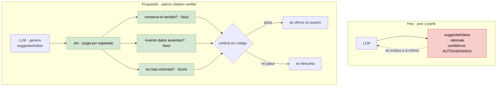

# 03 — `confidence` autoreportado en `field_refiner`

**Tier 1** · **Tipo:** reemplazo · **Estado actual:** existe y funciona · **Gobernanza:** no contradice ADR-027

## Resumen ejecutivo

`FieldRefinement` pide al mismo modelo que genera una mejora de texto que además **puntúe su
propia confianza** en esa mejora. Es juez y parte. El corpus de `awesome-jev` no hace esto en
ningún caso: cuando la confianza gatilla una acción, viene de un evaluador separado.

Es el caso más chico, más barato y de menor riesgo de los ocho. Buen candidato para validar
la integración con impacto real pero acotado.

## El problema en una imagen

`D2` es el que convierte la instruccion de prompt *"NO inventes datos"* en un gate
comprobable.

## Dónde

| Qué | Anchor |
|---|---|
| Contrato | `ai-service/agents/field_refiner.py:32` |
| `confidence` autoreportado | `field_refiner.py:37` |
| Instrucción anti-invención | `field_refiner.py:40-46` (*"NO inventes datos, métricas ni hechos"*) |

## Qué se le pregunta a Jev

El LLM sigue generando `suggestedValue` y `rationale`. Jev responde por separado, contra el
par (valor original, valor sugerido):

| Pregunta | Primitivo |
|---|---|
| ¿La versión sugerida conserva el sentido del valor original? | Noul |
| ¿Introduce datos, métricas o hechos ausentes del valor original y del contexto? | Noul |
| ¿Es más concreta y accionable que el original? | Score |

La segunda es la importante: hoy *"no inventes datos"* es una instrucción de prompt que nadie
verifica. Convertirla en un Noul con umbral la vuelve un gate comprobable.

## Qué mejora respecto de hoy

**La confianza pasa a ser un juicio independiente del generador.** El patrón canónico del
corpus es `citation-verifier`: *"Claude locating the quote, Jev scoring the support, and a
human making the final call"*. Tres roles separados. Hoy `field_refiner` colapsa los dos
primeros en el mismo modelo.

**La regla anti-invención se vuelve verificable.** Esto conecta con el contrato de producto,
que prohíbe explícitamente que la IA afirme cosas sin evidencia. Un Noul dedicado es el
mecanismo; una línea de prompt es una intención.

## Patrón de referencia

`citation-verifier` (generación, evaluación y decisión en tres actores distintos) y
`Sniff Test`, que hace diez preguntas booleanas por párrafo a umbral 0.7 con 182 ms de
mediana — el mismo shape de "evaluar prosa generada con preguntas cerradas".

## Evaluación

| Dimensión | Valor |
|---|---|
| Esfuerzo | **Bajo** — archivo de 4 KB, contrato de tres campos |
| Riesgo de regresión | **Bajo** — el campo hoy es de dudosa utilidad; empeorarlo es difícil |
| Dependencias | Ninguna |
| Medible con | Casos etiquetados a mano: ¿la mejora inventó datos, sí o no? |

## Criterio de aceptación propuesto

1. Sobre un set etiquetado de refinamientos, el Noul de invención detecta ≥ 90% de los casos
   donde el modelo agregó datos ausentes.
2. Falsos positivos ≤ 10% — si bloquea mejoras legítimas, el refinador deja de servir.
3. Latencia agregada < 300 ms sobre la llamada de generación.

## Qué puede salir mal

**Nadie sabe para qué se usa hoy `confidence`.** Antes de reemplazarlo hay que rastrear quién
lo consume aguas abajo (front, backend, o nadie). Si nadie lo lee, el caso se reduce a borrar
el campo y el valor real está en los otros dos Noul. Eso **hay que verificarlo antes de
estimar**; no está resuelto en este análisis.

**Riesgo de sobre-bloqueo.** Un umbral mal puesto en el Noul de invención convierte un
asistente de redacción en un corrector que rechaza todo. El criterio 2 existe por esto.
