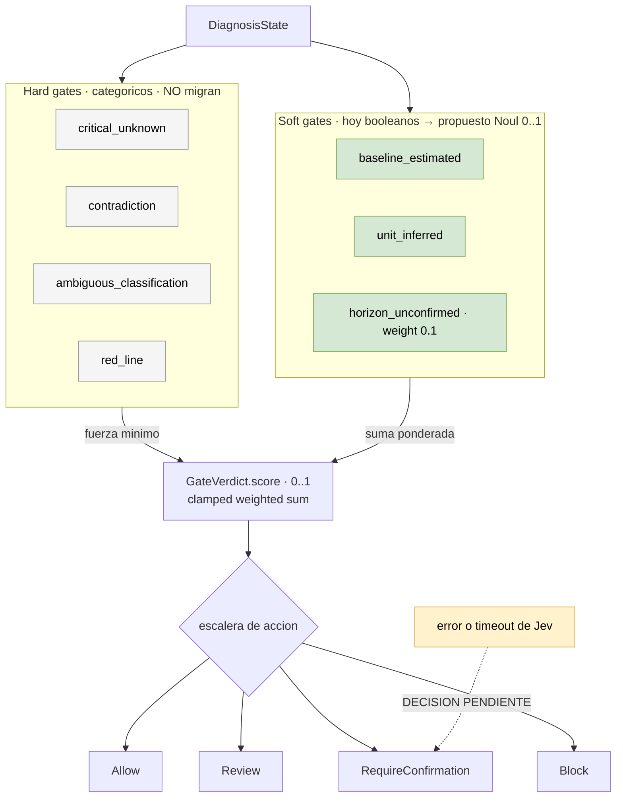

# 04 — Soft gates booleanos → probabilidades

> **Actualización de auditoría — 2026-09-20:** consultar [Jev y dataset v2](10-evaluacion-routing-dataset-v2.md).
> Ya hay 36 casos y un brazo Jev experimental. La revisión corrige la atribución de fallos al
> umbral high, detecta diferencias de preparación de estado entre brazos y distingue resultados
> históricos de conclusiones aún no verificadas. Las propuestas siguientes no son decisiones aprobadas.

**Tier 2** · **Tipo:** reemplazo · **Estado actual:** existe y funciona · **Gobernanza:** requiere enmienda a ADR-027

## Resumen ejecutivo

`GateVerdict.score` está documentado como *"the clamped 0..1 weighted sum of triggered
gates"* — o sea, la arquitectura ya espera valores continuos. Pero los soft gates que lo
alimentan son **booleanos**: disparan o no disparan. Se está sumando con precisión decimal
una entrada de un solo bit.

Los `noul` devuelven probabilidades 0..1 de forma nativa. Encajan en esa suma sin adaptador.

## La escalera

La flecha punteada es la decision de fail-safe: ante fallo de Jev, el gate cae a
`RequireConfirmation` (no dejar pasar nada sin verificar) o a `Allow` (no bloquear el
producto). El corpus hace las dos cosas segun el contexto.

## Dónde

| Qué | Anchor |
|---|---|
| Contrato del veredicto | `ai-service/harness/contracts.py` → `GateVerdict` |
| Escalera de acciones | `GateAction = Literal["Allow", "Review", "RequireConfirmation", "Block"]` |
| Evaluación | `ai-service/harness/gates.py:103` (`GateEvaluator.evaluate`) |
| Hard gates | `methodology.yaml:55-71` (`critical_unknown`, `contradiction`, `ambiguous_classification`, `red_line`) |
| Soft gates | `methodology.yaml:74-89` (`baseline_estimated`, `unit_inferred`, `horizon_unconfirmed`) |

## Qué se le pregunta a Jev

Los tres soft gates actuales, reformulados como Noul contra el mismo state:

| Gate | Pregunta | Hoy |
|---|---|---|
| `baseline_estimated` | ¿El baseline declarado es una estimación y no un dato medido? | booleano |
| `unit_inferred` | ¿La unidad fue inferida y no declarada por el usuario? | booleano |
| `horizon_unconfirmed` | ¿El horizonte temporal quedó sin confirmar? | booleano |

Los hard gates **se quedan como están**. Son categóricos por diseño: un `red_line` no admite
un 0.6.

## Qué mejora respecto de hoy

**La escalera de acciones se vuelve proporcional.** Hoy tres soft gates que disparan producen
el mismo `score` sin importar qué tan marginal sea cada uno. Con probabilidades, un baseline
claramente estimado pesa más que uno dudoso, y `Review` deja de activarse por acumulación de
casos límite.

**Encaja con la forma dominante del corpus.** `pi-verdict` la describe de forma precisa:
*"deterministic rules settle clear cases first, deny blocks, ask escalates to a human
confirm, and errors or timeouts deny"*. Es la misma escalera de cuatro niveles que Starteria
ya tiene. El corpus la valida como el patrón más usado en producción.

## Patrón de referencia

`pi-verdict` (escalera allow/ask/deny con reglas primero y Jev solo en la zona gris) y
`jev-axi`, que *"decide routine commands locally so nothing is sent for them"* — el principio
de no gastar una llamada en lo que una regla ya resuelve.

## Evaluación

| Dimensión | Valor |
|---|---|
| Esfuerzo | **Medio** — tres preguntas, pero hay que recalibrar pesos y umbrales de toda la escalera |
| Riesgo de regresión | **Medio** — cambia cuándo se interrumpe a un humano |
| Dependencias | Se beneficia del caso [01](01-route-profile-interpret.md), pero no lo requiere |
| Medible con | Tasa de `RequireConfirmation` y `Block` contra el histórico |

## Criterio de aceptación propuesto

1. Sobre el histórico, la distribución de `GateAction` no se desplaza más de ±10% por nivel
   sin justificación explícita caso por caso.
2. Ningún caso que hoy da `Allow` pasa a `Block`, ni al revés, sin revisión manual.
3. Los hard gates mantienen comportamiento idéntico. Cualquier cambio ahí es un bug.

## Qué puede salir mal

**Recalibrar los pesos es más trabajo que escribir las preguntas.** Los pesos actuales fueron
ajustados para entradas booleanas. Sustituir la entrada por un continuo sin recalcular los
pesos desplaza la escalera entera de forma silenciosa — y el síntoma (más o menos
interrupciones a humanos) tarda en notarse.

**El fail-safe tiene que ser explícito.** El corpus es unánime: `pi-verdict` deniega ante
error o timeout; `jev-belay` *"fails open on any error"*. Son decisiones opuestas y ambas
correctas para su contexto. Acá hay que decidirlo a propósito: ante fallo de Jev, ¿el gate
cae a `Allow` (no bloquear el producto) o a `RequireConfirmation` (no dejar pasar nada sin
verificar)? Dado que el contrato de producto insiste en que nada se publica
automáticamente, la respuesta probable es la segunda — pero es una decisión, no un default.
