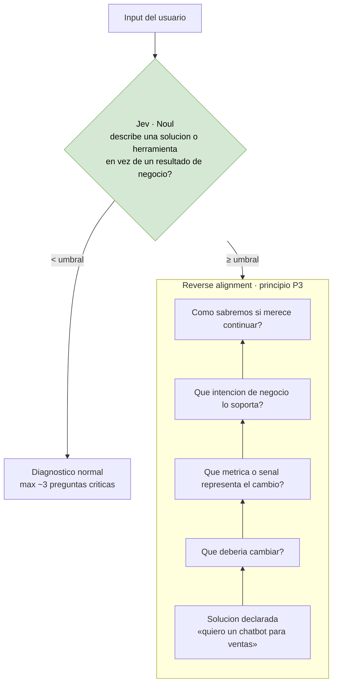

# 05 — Detección solution-first (principio P3)

**Tier 2** · **Tipo:** CAPACIDAD NUEVA · **Estado actual:** no existe como mecanismo · **Gobernanza:** aditivo, no contradice ADR-027

## Resumen ejecutivo

El contrato de producto dedica un principio entero a esto. Si el usuario entra diciendo
*"quiero implementar un chatbot para ventas"*, Starteria **no debe saltar a ejecución**:
debe hacer *reverse alignment* y reconstruir hacia arriba qué intención de negocio soporta
esa solución.

Hoy eso existe como instrucción dentro de un prompt. No hay un mecanismo que lo verifique ni
una señal que lo registre. Es una pregunta binaria de una línea.

**Recomendado como spike de producto:** capacidad nueva, cero superficie de regresión, y
valida un principio que el contrato exige.

## Dónde dispara



El falso positivo vive en la rama de arriba: mandar a reverse alignment a alguien que ya
declaro su resultado de negocio rompe la promesa de la Pantalla 1. Por eso el criterio 2 es
mas estricto que el 1.

## Dónde

| Qué | Anchor |
|---|---|
| El principio | `doc/STARTERIA_CRAZY8S_E2E_BASE_LOGIC_v0.1.md` § *P3 — Starteria no acepta una solución sin buscar su justificación* |
| Dónde debería disparar | Pantalla 1 (Landing) y Pantalla 2 (Diagnóstico) del mismo doc |
| Implementación actual | Ninguna explícita. Vive difuso en el prompt de `interpret` |

El doc define la escalera de reverse alignment:

```
Solución ↑ ¿Qué debería cambiar? ↑ ¿Qué métrica/señal representa el cambio?
↑ ¿Qué intención de negocio soporta? ↑ ¿Cómo sabremos si merece continuar?
```

## Qué se le pregunta a Jev

| Pregunta | Primitivo |
|---|---|
| El input describe una solución, herramienta o tecnología específica en vez de un resultado de negocio | **Noul** |
| El input declara una métrica o señal de éxito | Noul |
| El input declara qué debería cambiar en el negocio | Noul |

La primera sola ya habilita el caso. Las otras dos permiten saber **en qué escalón** de la
escalera entra el usuario, que es lo que determina cuántas preguntas hacen falta — y el doc
fija un máximo de ~3.

## Qué mejora respecto de hoy

**Un principio de producto pasa de instrucción a mecanismo.** Hoy la única garantía de que
P3 se cumple es que el prompt lo pida y el modelo obedezca. Nadie lo mide. Con un Noul a
umbral, es una señal registrable, auditable y con tasa de acierto conocida.

**Conecta con la telemetría de producto.** Saber qué porcentaje de usuarios entra
solution-first es un dato de negocio, no solo un detalle técnico: el doc lista ese caso como
uno de los cinco puntos de entrada esperados. Hoy no se puede contar.

## Patrón de referencia

`Notra` — *"routes brand-visibility classifiers off an LLM and onto Jev Boolean decisions at
a 0.5 threshold, targeting 300 ms p50"*. Mismo shape: una pregunta binaria a umbral fijo en
el camino caliente.

## Evaluación

| Dimensión | Valor |
|---|---|
| Esfuerzo | **Bajo** — una a tres preguntas, sin contrato que modificar |
| Riesgo de regresión | **Ninguno** — no reemplaza nada; si falla, se apaga |
| Dependencias | Ninguna |
| Medible con | Un set de inputs etiquetados a mano (solution-first sí/no). Hay ejemplos en el propio doc |

## Criterio de aceptación propuesto

1. Sobre un set etiquetado de ~50 inputs reales, detecta ≥ 90% de los solution-first.
2. Falsos positivos ≤ 5%. Un falso positivo es caro: le pregunta "¿qué querés lograr?" a
   alguien que ya lo dijo, y eso contradice la promesa de la Pantalla 1 de poder empezar sin
   fricción.
3. p50 < 300 ms, para que quepa en el camino interactivo.

## Qué puede salir mal

**La frontera es más borrosa de lo que parece.** *"Quiero aumentar las ventas en 200 este
trimestre"* es un resultado. *"Quiero un chatbot"* es una solución. Pero *"quiero automatizar
la atención al cliente para bajar el tiempo de respuesta"* tiene las dos cosas. El set de
etiquetado tiene que incluir estos casos mixtos, o el umbral se calibra contra un problema
más fácil que el real.

**El falso positivo es asimétricamente caro.** No detectar un solution-first degrada la
calidad del diagnóstico. Marcar como solution-first a alguien que ya declaró su resultado de
negocio rompe la primera impresión del producto. Por eso el criterio 2 es más estricto que
el 1.
