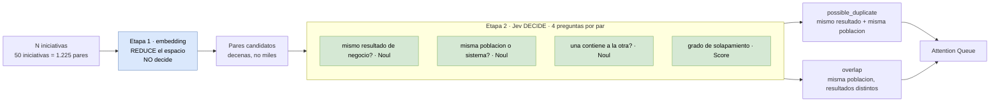

# 06 — `possible_duplicate` y `overlap`

**Tier 2** · **Tipo:** CAPACIDAD NUEVA · **Estado actual:** no existe · **Gobernanza:** aditivo

## Resumen ejecutivo

El contrato de producto pide detectar duplicidad y solapamiento entre iniciativas, y en la
misma sección pone una regla dura:

> **La similitud semántica no es prueba de duplicidad.**

Esa frase descarta la solución obvia. Un embedding responde *"estos dos textos se parecen"*.
La pregunta que el producto necesita es **"estas dos iniciativas persiguen el mismo resultado
de negocio"** — que no es lo mismo, y que dos textos redactados de forma distinta pueden
cumplir mientras dos textos casi idénticos no.

## La arquitectura de dos etapas

Esto no contradice la regla del doc, y conviene ser preciso: el embedding **filtra**, Jev
**decide**. La regla prohibe usar similitud como *prueba*, no como pre-filtro.

## Dónde

| Qué | Anchor |
|---|---|
| Las señales | `doc/...CRAZY8S...md` § *Attention Queue* — `possible_duplicate`, `overlap` |
| La regla | Mismo doc, Pantalla 6 (Reto / Cobertura) |
| Implementación actual | Ninguna |

El doc también exige que la IA, cuando detecta, **explique por qué** — no basta con marcar.

## Qué se le pregunta a Jev

Contra un state que contiene el par de iniciativas y su contexto de prioridad:

| Pregunta | Primitivo |
|---|---|
| Ambas iniciativas persiguen el mismo resultado de negocio | **Noul** |
| Ambas actúan sobre la misma población, sistema o proceso | Noul |
| Una es un subconjunto de la otra | Noul |
| Grado de solapamiento | **Score** (nulo → parcial → total) |

La separación entre las tres primeras es lo que distingue **duplicidad** (mismo resultado,
misma población) de **solapamiento** (misma población, resultados distintos) — que el doc
trata como señales diferentes y que un score único colapsaría.

## Qué mejora respecto de hoy

**Da un mecanismo a una regla que hoy no tiene ninguno.** No es una mejora de costo ni de
latencia: es funcionalidad que el contrato pide y que no está construida.

**Las probabilidades son la explicación que el doc exige.** Cada alerta debe mostrar *"qué
evidencia existe"*. Cuatro probabilidades por par de iniciativas, con la pregunta escrita en
lenguaje natural al lado, **son** esa evidencia — y son auditables por el humano que recibe
la alerta.

## Patrón de referencia

`jev-reranker` — *"uses Noul judgments to assess retrieved documents for relevance and
usefulness as answer evidence, then sorts results and optionally filters them using a
configurable threshold."* Mismo shape: Noul + umbral configurable sobre pares candidatos.

## Evaluación

| Dimensión | Valor |
|---|---|
| Esfuerzo | **Medio** — las preguntas son simples; el costo está en el fan-out |
| Riesgo de regresión | **Ninguno** — capacidad nueva |
| Dependencias | Requiere una etapa previa de candidatos (ver abajo) |
| Medible con | Pares etiquetados a mano por alguien de producto |

## Criterio de aceptación propuesto

1. Sobre pares etiquetados, precisión ≥ 80% en `possible_duplicate`. Precisión importa más
   que recall: una alerta falsa de duplicidad manda a dos equipos a una reunión innecesaria.
2. Duplicidad y solapamiento se distinguen correctamente ≥ 80% de las veces. Colapsarlos
   contradice el doc.
3. Toda alerta llega acompañada de las probabilidades que la generaron.

## Qué puede salir mal

**El problema real es cuadrático.** Con N iniciativas hay N(N−1)/2 pares. Con 50 iniciativas
son 1.225 pares, y hacerle cuatro preguntas a cada uno no escala aunque cada llamada sea
barata. **Hace falta una etapa de candidatos previa** — y ahí sí un embedding es la
herramienta correcta, para *reducir el espacio*, no para decidir.

Vale la pena ser preciso sobre esto, porque parece contradecir la regla del doc y no lo hace:
el embedding filtra, Jev decide. La regla prohíbe usar similitud **como prueba**, no como
pre-filtro.

**Esta arquitectura de dos etapas no está diseñada.** Es la pieza que falta antes de poder
estimar este caso en serio.
