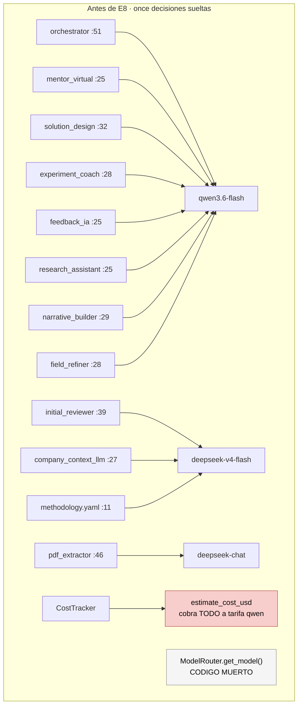

# 07 — El router que nadie llama

**Tier 3** · **Tipo:** completar un stub · **Estado actual:** selección muerta, precio corregido en [E8](00-medicion.md) · **Gobernanza:** aditivo

## Resumen ejecutivo

`services/model_router.py` tenía dos funciones. Una estaba muerta y la otra tenía un bug en
producción.

`get_model(_agent_id)` ignoraba su argumento y devolvía siempre el mismo modelo — pero eso era
lo de menos: **no la llama nadie**. Sus únicos consumidores son `tests/test_model_router.py` y
`tests/test_wiring.py`. Los once agentes hardcodean su modelo, cada uno en su propio archivo.

`estimate_cost_usd(_agent_id, ...)` **también** ignoraba el `agent_id` y cobraba todo a tarifa
qwen, mientras la mitad de los agentes corre deepseek. Esa era la función viva, alimentando
`check_project_daily_budget()`. **Corregida en E8.**

## Dónde estaba decidido el modelo, realmente



| Qué | Anchor |
|---|---|
| El stub muerto | `services/model_router.py` → `get_model()` |
| El bug de precio | mismo archivo → `estimate_cost_usd()` · **corregido** |
| Consumidor real | `services/cost_tracker.py:46`, `:88` |
| Modelo del harness | `harness/config/methodology.yaml:11` *(config — el único bien puesto)* |
| Benchmark propio | `agents/initial_reviewer.py:34-37` |

## Qué se le pregunta a Jev

`docs/jev/intent-routing.md` trae el patrón canónico, y tiene un detalle de API que cambia
cómo se escriben las preguntas: **las `criteria`**. Un Choice no lista opciones sueltas,
lista opción → descripción. Un Score lista niveles ordenados.

```python
questions = {
  "task_kind": {
    "type": "choice",
    "instructions": "Qué clase de trabajo requiere realmente este request",
    "criteria": {
      "closed_classification": "Asignar a categorías que ya existen (ruta, step, tipo de reto)",
      "extraction":            "Sacar hechos textuales del input o de un documento adjunto",
      "bounded_prose":         "Redactar un texto breve y acotado a partir de hechos dados",
      "open_reasoning":        "Análisis, diseño o síntesis multi-paso sin forma predeterminada",
    },
  },
  "complexity": {
    "type": "score",
    "instructions": "Cuánto razonamiento exige resolver este request",
    "criteria": [
      "Consulta directa o un único juicio acotado",
      "Combina varios hechos, juicio moderado",
      "Contradictorio, inusual o de alto riesgo — necesita razonamiento profundo",
    ],
  },
  "needs_structured_output": {
    "type": "noul",
    "instructions": "La respuesta debe ajustarse a un JSON schema estricto",
  },
}
```

### El ruteo, con el branch que no llama a nadie

El doc dice algo que vale más que el resto: *"One intent routes to deterministic code with no
LLM involved."* El branch más barato del router **no elige un modelo más barato — no llama a
ningún modelo.**

```python
def route(response):
    kind       = response.answers["task_kind"]
    complexity = response.answers["complexity"]
    structured = response.answers["needs_structured_output"]

    # 1. Sin confianza en la clasificación no se experimenta: default verificado.
    if kind.confidence < 0.6:
        return VERIFIED_DEFAULT, "high"

    # 2. El branch que no invoca a nadie: Jev ya respondió. Ver caso 01.
    if kind.choice == "closed_classification":
        return NO_LLM, None

    # 3. json_schema es un constraint duro, no una preferencia de costo.
    if structured.noul > 0.5:
        return STRUCTURED_VERIFIED, "low"

    # 4. Complejidad Y su incertidumbre deciden el esfuerzo — el idiom del doc.
    if complexity.score > 1 or complexity.confidence < 0.5:
        return CAPABLE_TIER, "high"

    return CHEAP_TIER, "low"
```

La línea 4 es literal del doc: no alcanza con que el score sea bajo, hay que confiar en que
es bajo. Un score de complejidad baja con confianza baja significa *"no sé"*, no *"es fácil"*.

### Modelo **y** esfuerzo, por input

El esfuerzo no es un parámetro secundario: GLM-5.3 razona siempre con `max` por defecto,
Bonsai en `xhigh`. Los tokens de razonamiento se facturan como output, así que el mismo modelo
cuesta varias veces más según el esfuerzo. Elegir modelo sin elegir esfuerzo es decidir la
mitad barata.

| Decisión | Modelo | Esfuerzo | Costo relativo |
|---|---|---|---|
| `closed_classification` | **ninguno** | — | **$0** |
| `extraction` | `deepseek-v4.1-flash` | `low` | 0.52× in · 0.35× out |
| `bounded_prose` simple | `deepseek-v4.1-flash` | `low` | 0.52× · 0.35× |
| structured output | verificado en `json_schema` | `low` | según benchmark |
| complejo o incierto | `glm-5.3` · `gemini-3.8-flash` | `high` / `max` | 3–6× |

Precedente exacto en el corpus: `jcm-router` *"picks the Claude model **and reasoning effort**
per message"*.

## Reglas de política, tomadas de `jev-router`

`jev-router` (gargpratyush) es una implementación en producción del mismo problema: ruteo por
turno para Claude Code y Codex. Su `src/policy.mjs` tiene cinco reglas que no salen de leer
los docs de TypeSafe — salen de operar el router.

### 1. La confianza es asimétrica

> *"Low confidence never downgrades and caps upgrades at the balanced tier."*

Un umbral simétrico es el error obvio. Baja confianza significa **no sé**, y ante *no sé*
nunca se abarata — pero tampoco se justifica saltar al tier caro. Se sube un escalón, no dos.

```python
if kind.confidence < THRESHOLD:
    return max(current_tier, BALANCED), "high"   # nunca por debajo, nunca hasta el tope
```

### 2. El prompt-cache puede costar más que el modelo

> *"Large conversations refuse downgrades that would waste more prompt-cache work than they
> save."*

Cambiar de modelo invalida el caché de prefijo. En una conversación larga, reconstruirlo
cuesta más que lo que ahorra la tarifa menor. El ahorro por token no es el ahorro real.

Para Starteria aplica de forma desigual: las etapas del harness van con prompt acotado y
fresco (8k/12k), así que no las afecta. Los loops de deepagents, que sí son multi-turno con
`thread_id` persistente, sí.

### 3. Tiers abstractos, no ids de modelo

`jev-router` rutea a **Fast / Balanced / Strong / Long**, y el mapeo tier → modelo vive en
config (`JEV_CODEX_FAST_MODEL`, etc.).

Dado el catálogo de más arriba —dos modelos en promoción, lanzamientos semanales, un SKU que
resultó no ser el que el índice puntúa— esa indirección es lo que hace que la política
sobreviva al churn. Un router que codifica `"deepseek/deepseek-v4.1-flash"` en su lógica se
reescribe cada vez que sale un modelo.

### 4. Ante indisponibilidad, escalar

> *"Unavailable tiers step upward rather than silently choosing a weaker model."*

Falla hacia arriba. Nunca hacia abajo en silencio — el modo de fallo caro es visible en la
factura, el barato es invisible y degrada resultados.

### 5. Una decisión por turno, no por paso

> *"Tool-loop continuations keep the tier chosen at the start of the turn. Main conversations
> and sub-agents are pinned separately."*

La latencia del clasificador se paga una vez por invocación, no por cada paso interno. Y el
pin separado entre conversación principal y sub-agentes mapea directo: el orchestrator y los
step agents son decisiones distintas.

### 6. Fail-open, siempre

> *"Routing is fail-open: Jev failure never blocks the CLI."*

Misma decisión que tomamos en [E8](00-medicion.md) para el precio desconocido, y por la misma
razón: un router caído no puede tirar el producto abajo.

### La disanalogía que hay que marcar antes de copiar

`jev-router` rutea turnos de un CLI interactivo. Starteria rutea invocaciones server-side.
La diferencia importa en dos reglas:

| Regla de `jev-router` | En Starteria |
|---|---|
| *"failure keeps the current model"* | **No traduce.** No hay modelo "actual" — cada request es fresco. El equivalente es caer al default verificado de ese call site |
| *"explicit requests such as `use opus` win"* | **Ya existe**: `OPENROUTER_MODEL` overridea en cuatro agentes. Es la misma regla, implementada antes de conocerla |

### Sus dimensiones de scoring

`/jev-explain` muestra que Jev puntúa cuatro ejes: **task complexity · reasoning required ·
tool complexity · context size**. Es mejor conjunto que un solo score de complejidad.

Para Starteria conviene combinarlos con `task_kind`, porque el branch que más ahorra
—`closed_classification`, el que no llama a nadie— no se deriva de ninguna de esas cuatro
dimensiones: depende de la **forma** de la tarea, no de su dificultad.

### Una idea que vale copiar aparte: el log de decisiones

`jev-router` guarda las últimas 20 decisiones por sesión —prompt, request y response
exactos— y `/jev-explain` **renderiza desde eso, sin volver a preguntarle a Jev**. Los
archivos son modo 600 en un directorio 700, y se borran a los 7 días.

Eso es auditabilidad de ruteo por unos centavos de disco, y encaja con lo que el contrato de
producto exige de toda alerta: *qué evidencia existe*. Un router que no puede explicar por
qué eligió lo que eligió es imposible de depurar cuando el costo se dispara.

## El catálogo, con precios reales

| Modelo | In | Out | vs qwen in | vs qwen out |
|---|---:|---:|---:|---:|
| `prism-ml/ternary-bonsai-2-27b` | $0.075 | $0.50 | **0.30×** | **0.33×** |
| `deepseek/deepseek-chat` | $0.14 | $0.28 | 0.56× | **0.19×** |
| `qwen/qwen3.6-flash` *(baseline)* | $0.25 | $1.50 | 1× | 1× |
| `z-ai/glm-5.3-flashx` | $0.37 | $1.25 | 1.48× | 0.83× |
| `google/gemini-3.8-flash` | $0.75 | $3.75 | 3× | 2.5× |
| `z-ai/glm-5.3` | $0.8442 | $2.653 | 3.38× | 1.77× |

Gemini y GLM-5.3 están en promoción (50% y 40%). A precio de lista Gemini es **6× el input y
5× el output** del baseline.

### Bonsai: barato por token, caro por tarea, imposible por latencia

Es 3× más barato en ambos ejes — y aun así probablemente no sirve. Piensa por defecto en
`xhigh`, y el panel de proveedores reporta **7 tps con un único proveedor** (Darkbloom), o sea
sin failover.

| Modelo | Tokens out estimados | Costo | Tiempo |
|---|---:|---:|---:|
| qwen3.6-flash *(sin razonamiento)* | ~500 | $0.00075 | — |
| Bonsai `xhigh` *(~3.000 razonamiento + 500)* | ~3.500 | **$0.00175** | **~8 min** |

Esos tokens son **estimados, no medidos** — y la contabilidad de [E6](00-medicion.md) existe
justamente para reemplazarlos por números reales.

Contexto de latencia: `deepseek-v4-flash` tarda **15–17 s** por llamada y las etapas son dos,
o sea que `/api/v1/ai/diagnose` ya tolera ~30 s. La barra es más baja de lo que parecería.
Bonsai queda afuera por orden de magnitud, no por poco. **Dónde sí podría servir:** trabajo
batch como el `pdf_extractor`, que no es interactivo y ya tiene cap de costo.

## No es un router, son dos

`methodology.yaml:8-10` documenta un constraint que ninguna tabla de precios puede ignorar:
*"deepseek-v4-flash is the model initial_reviewer benchmarked as reliable for OpenRouter
json_schema structured output (**qwen fails it**)"*.

| Call site | Tarea | Catálogo | Constraint |
|---|---|---|---|
| `agents/*` | Generación libre | qwen + escalaciones | ninguno |
| `harness` `ground`/`interpret` | Structured output | solo modelos **verificados** en `json_schema` | duro |

Ninguno de los candidatos declara garantía de `json_schema`. Rutear una etapa a un modelo no
verificado reintroduce las truncaciones por las que existe el retry de dos intentos.

### El benchmark correcto ya existe, y no es un índice general

`agents/initial_reviewer.py:34-37`, fechado 2026-07-12, n=3 sobre el schema real:

| Modelo | Éxito | Latencia | Costo/call |
|---|---|---|---|
| `deepseek-v4-flash` | **3/3** | 15–17 s | **$0.0004** |
| `qwen3.6-flash` | **0/3** — JSON incompleto | — | $0.003–0.005 |
| `deepseek-chat` | 1/3 — divaga y trunca | — | — |
| `mimo-v2.5` | 0/3 | — | — |

qwen sale **7,5–12,5× más caro y encima falla**: paga output generando JSON roto.

El Artificial Analysis Intelligence Index **no sirve para esta decisión**. Sus 10 evaluaciones
—Terminal-Bench, SciCode, Humanity's Last Exam, GDPval, CritPt— miden razonamiento frontier.
Las etapas hacen clasificación acotada en español sobre enums cerrados con `json_schema` en un
prompt de 8k. Además el catálogo no se cruza: `GLM-5.3-Flash` (42) no es `GLM-5.3-FlashX`,
`DeepSeek V4.1 Flash` (39) no es `deepseek-v4-flash`, Bonsai no está, y **`qwen3.6-flash`
—el baseline— tampoco**. Solo Gemini 3.8 Flash (41) y GLM-5.3 (45) tienen precio y puntaje del
SKU exacto.

Sirve como techo de capacidad para escalaciones en `agents/*`. No para las etapas.

## Evaluación

| Dimensión | Valor |
|---|---|
| Esfuerzo | **Medio** — ya no es "completar 32 líneas": hay que centralizar once hardcodeos |
| Riesgo de regresión | **Ninguno** — detrás de flag, con fallback al modelo actual |
| Dependencias | E8 ✅ · E9 ✅ — ya no hay bloqueantes técnicos |
| Medible con | `CostTracker`, ya instrumentado — pero ver E9 |

## Criterio de aceptación propuesto

1. Costo total por proyecto **baja** contra el baseline, sobre tráfico real en una ventana
   definida.
2. Ninguna degradación detectable en los agentes ruteados a modelos más baratos, medida con
   los evals existentes, no por impresión.
3. Latencia agregada del ruteo < 100 ms p95. Si el router tarda más de lo que ahorra, no sirve.
4. Cero llamadas a modelos no verificados en `json_schema` desde las etapas del harness.

## Qué puede salir mal

**El presupuesto medía cero por el camino principal — corregido en [E9](00-medicion.md).**
`orchestrator.py` registraba `input_tokens=0, output_tokens=0` con la nota *"deepagents does
not expose token counts directly"*, que estaba desactualizada. Ahora un `UsageCollector`
observa las llamadas de cada invocación, y los tokens que [E6](00-medicion.md) captura en el
`StageTrace` también llegan al presupuesto. El criterio 1 ya es verificable.

**Optimizar solo precio rompe el producto.** Un router que minimiza costo elige Bonsai y
convierte un diagnóstico de 30 s en uno de varios minutos. Throughput y latencia tienen que
estar en el catálogo, no descubrirse en producción.

**El precio por token no es el costo por tarea.** Con modelos que razonan por defecto, un
modelo a un tercio de la tarifa que emite cinco veces más output sale más caro. Solo la
medición de E6 lo resuelve.

**Centralizar es el trabajo, no el router.** Once agentes deciden su modelo por su cuenta.
Mientras eso siga así, un router "inteligente" no tiene por dónde entrar: no hay un punto
único que consultar. Esa centralización es prerequisito y es más aburrida —y más riesgosa—
que la pregunta a Jev.

**El router no reemplaza elegir bien el default.** Si un modelo domina a otro en todos los
ejes medibles, ninguna clasificación por request mejora esa constante. El router opera
**encima** del default: el default fija el piso, el router decide cuándo ese piso no alcanza.
Son capas, no alternativas — y meter el router antes de corregir el default es pagar
complejidad por un ahorro que una línea de configuración ya daba.

**`sort: "throughput"` en las llamadas de structured output.** `harness/llm.py:129` y
`agents/initial_reviewer.py:158` le piden a OpenRouter el proveedor **más rápido**, en
exactamente las llamadas cuyo modo de fallo documentado es "JSON incompleto". OpenRouter
ofrece el modo **Exacto** — *"highest tool-calling accuracy"*. Es un cambio de una palabra que
ataca la razón por la que existe el retry de dos intentos, y no necesita Jev.
