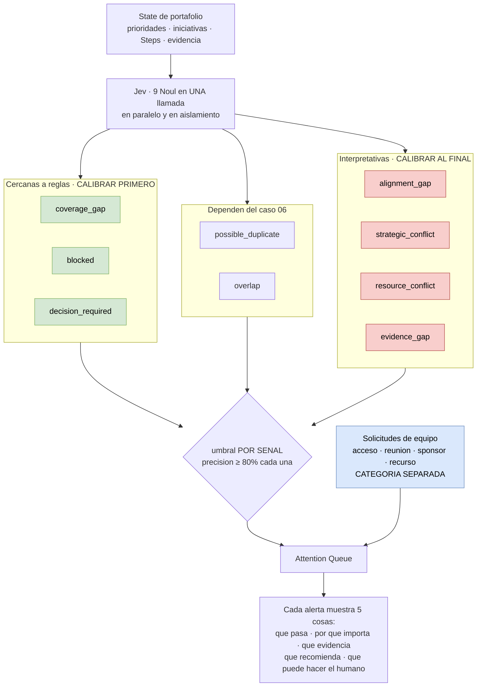

# 08 — Las nueve señales de la Attention Queue

**Tier 4** · **Tipo:** CAPACIDAD NUEVA · **Estado actual:** no existe · **Gobernanza:** aditivo

## Resumen ejecutivo

La Pantalla 4 del contrato de producto —el Home del Portfolio Lead— responde una sola
pregunta: **¿qué requiere atención hoy?** Su contenido central es la Attention Queue, con
nueve tipos de señal. Ninguna está implementada.

Las nueve son preguntas cerradas contra un mismo estado de portafolio, y el modelo System One
las evalúa **en paralelo en una sola llamada**: agregar preguntas casi no cambia el tiempo de
respuesta y cada una se evalúa en aislamiento, sin contaminarse entre sí.

Es el caso de mayor valor de producto y el de mayor riesgo de ejecución. **No por lo técnico
— por la calibración.**

## Nueve preguntas, una llamada, umbrales separados

Rojo es donde vive el riesgo de `Abide` (10 de 39 confirmadas sin calibrar). Verde es por
donde conviene empezar: se calibra facil y construye la infraestructura de medicion antes de
gastar el presupuesto de confianza del usuario.

## Dónde

| Qué | Anchor |
|---|---|
| La pantalla | `doc/...CRAZY8S...md` § *4. Home del Portfolio Lead / Centro de atención* |
| Las nueve señales | Misma sección, *Attention Queue* |
| Separación de categorías | Pantalla 6 — *"Solicitudes de equipo: separarlas de señales del sistema"* |
| Implementación actual | Ninguna |

## Qué se le pregunta a Jev

Nueve Noul contra un state de portafolio, en una llamada:

| Señal | Pregunta |
|---|---|
| `alignment_gap` | La iniciativa no contribuye de forma identificable a ninguna prioridad activa |
| `possible_duplicate` | → ver caso [06](06-duplicidad-solapamiento.md) |
| `overlap` | → ver caso [06](06-duplicidad-solapamiento.md) |
| `strategic_conflict` | Dos iniciativas activas persiguen objetivos que se contradicen |
| `resource_conflict` | Dos o más iniciativas dependen del mismo recurso escaso |
| `coverage_gap` | Una prioridad activa no tiene ninguna iniciativa que la aborde |
| `evidence_gap` | La iniciativa avanzó de Step sin generar la evidencia que ese Step requiere |
| `blocked` | La iniciativa está detenida por una dependencia no resuelta |
| `decision_required` | Existe evidencia suficiente y una decisión pendiente de tomarse |

El doc exige que **cada alerta muestre cinco cosas**: qué pasa, por qué importa, qué
evidencia existe, qué recomienda Starteria, y qué acción puede realizar el humano. Las
probabilidades por pregunta cubren directamente la tercera.

## Qué mejora respecto de hoy

**Construye la pantalla que el producto vende.** El valor declarado del Home es *"no necesito
revisar todas las iniciativas para saber dónde intervenir"*. Sin la Attention Queue, esa
promesa no existe.

**La separación de categorías queda estructural.** El doc prohíbe mezclar señales del sistema
con solicitudes de equipo (acceso, reunión, sponsor, recurso, decisión, dependencia), aunque
se muestren juntas. Con preguntas tipadas, la frontera está en el tipo, no en una convención
de UI que alguien puede romper.

## Patrón de referencia

`jev-canvas` — ocho preguntas tipadas por cada transcripción parcial, *"plain code gates them
with thresholds"*, 300–550 ms por decisión. Mismo shape: N preguntas, un state, umbrales en
código, latencia interactiva.

## Evaluación

| Dimensión | Valor |
|---|---|
| Esfuerzo | **Alto** — nueve preguntas, un state de portafolio que hay que diseñar, y calibración por señal |
| Riesgo de regresión | **Ninguno** — capacidad nueva |
| Dependencias | Requiere el caso [06](06-duplicidad-solapamiento.md) resuelto (dos de las nueve) |
| Medible con | Nada existente. Hay que construir el set etiquetado |

## Criterio de aceptación propuesto

1. **Precisión ≥ 80% por señal**, medida por separado. Un promedio global esconde que una
   señal ruidosa arruine la cola entera.
2. Cada alerta llega con sus probabilidades y con la pregunta en lenguaje natural que la
   generó.
3. Ninguna señal se muestra a un Portfolio Lead antes de estar calibrada contra casos
   etiquetados. Ver abajo.

## Qué puede salir mal — el riesgo principal de todo este análisis

`Abide`, el proyecto del corpus que hace lo más parecido a esto (supervisar un agente y
marcar violaciones de reglas), reporta que **un revisor independiente confirmó 10 de 39
ediciones marcadas y 11 de 15 turnos**. Eso es ~26% de precisión en el primer caso, sin
calibrar.

En una Attention Queue esa tasa es destructiva. La promesa del Home es exactamente lo
contrario de revisar todo; una cola con 74% de ruido obliga a revisar todo **y además** a
desconfiar de la herramienta. El fracaso no sería técnico: sería que el Portfolio Lead deja
de abrir la pantalla.

**Consecuencia práctica:** las nueve señales necesitan casos etiquetados y umbrales por señal
**antes** de mostrarse, no después. Y conviene encenderlas de a una, midiendo cada una por
separado, en vez de lanzar las nueve juntas.

Hay un orden natural: `coverage_gap`, `blocked` y `decision_required` son las más cercanas a
reglas determinísticas —casi se derivan del estado del portafolio— y por lo tanto las más
fáciles de calibrar. `strategic_conflict` y `alignment_gap` son las más interpretativas y las
que más se benefician de Jev, pero también las más difíciles de etiquetar. Empezar por las
fáciles da la infraestructura de medición antes de gastar el presupuesto de confianza del
usuario en las difíciles.
