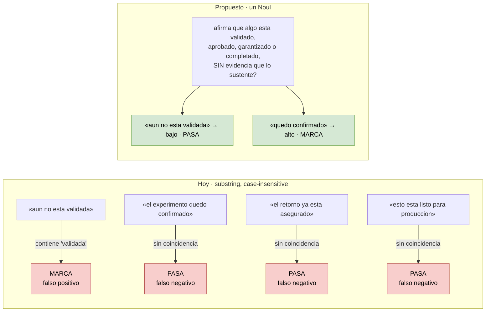

# 09 — Guardrails semánticos: la regla §19 es semántica, la implementación es `in`

> **Actualización de auditoría — 2026-09-20:** consultar [Jev y dataset v2](10-evaluacion-routing-dataset-v2.md).
> Ya hay 36 casos y un brazo Jev experimental. La revisión corrige la atribución de fallos al
> umbral high, detecta diferencias de preparación de estado entre brazos y distingue resultados
> históricos de conclusiones aún no verificadas. Las propuestas siguientes no son decisiones aprobadas.

**Tier 2** · **Tipo:** corrige una capacidad existente · **Estado actual:** existe y **falla en ambas direcciones** · **Gobernanza:** aditivo

## Resumen ejecutivo

La metodología prohíbe seis términos en el texto que la IA emite a humanos. La intención de
§19 es semántica: *que la IA no afirme que algo está validado, aprobado o garantizado sin
evidencia*. La implementación es una búsqueda de substring.

Eso falla en las dos direcciones, y la falla más grave es la menos obvia: **la negación
invierte el sentido y el substring no la ve**. Hoy el gate marca como violación frases que
hacen exactamente lo que la metodología pide.

Además escanea **dos campos**, y son los menos human-facing de todo el pipeline.

## Dónde

| Qué | Anchor |
|---|---|
| Los seis términos | `harness/config/methodology.yaml:90-97` |
| La verificación | `harness/gates.py:146-149` |
| Dónde se aplica | `harness/stages/deterministic.py:173-186` |
| El campo del veredicto | `harness/contracts.py:151` |

```yaml
prohibited_terms:  # §19 — must not appear in emitted human-facing text
  - validada
  - aprobada
  - garantizada
  - escalable
  - roi realizado
  - gantt definitivo
```

```python
# gates.py:146-149
haystack = " \n ".join(t for t in texts if t).lower()
return [term for term in self._gates.prohibited_terms if term.lower() in haystack]
```

## El problema, en cuatro frases



| Frase | Substring | Lo que realmente dice |
|---|---|---|
| *"aún no está **validada**"* | ✗ **marca** | lo contrario — **cumple** §19 |
| *"el experimento quedó confirmado"* | ✓ pasa | **viola** §19 |
| *"el retorno ya está asegurado"* | ✓ pasa | **viola** §19 |
| *"esto está listo para producción"* | ✓ pasa | **viola** §19 |

El primero es el que importa. Un falso positivo acá no es ruido: **marca como infracción una
frase prudente**, que es justo la redacción que la metodología quiere fomentar.

## El segundo hallazgo: qué se escanea

`run_gate` arma su lista de textos así:

```python
texts.extend(rp.rationale)
texts.extend(rp.conditions_that_would_change)
```

Solo esos dos campos del `RouteProfile`. **No escanea:**

- `ConfirmationRequest.strategic_questions` — preguntas generadas por la IA que el humano lee.
- Nada de lo que producen los agentes: `understandingSummary`, `critique`, `improvedProposal`
  de `initial_reviewer`; la prosa de `narrative_builder`, `mentor_virtual`, `solution_design`.

§19 dice *"emitted human-facing text"*. `rationale` y `conditions_that_would_change` son
metadatos de clasificación — lo **menos** human-facing del pipeline. El texto que un Portfolio
Lead realmente lee no pasa por ningún filtro.

## Qué se le pregunta a Jev

| Pregunta | Primitivo |
|---|---|
| El texto afirma que algo está validado, aprobado, garantizado o completado, **sin evidencia que lo sustente** | **Noul** |
| El texto presenta una estimación o proyección como si fuera un resultado medido | **Noul** |
| El texto promete un resultado futuro en vez de formular una hipótesis | **Noul** |

Las tres corresponden a intenciones distintas dentro de §19, y separarlas permite que el
mensaje del gate diga **cuál** se violó — que es lo que el contrato de producto exige de toda
alerta.

La cláusula *"sin evidencia que lo sustente"* es la que el substring no puede expresar y la
que resuelve el falso positivo de la negación.

## Por qué encaja con Jev específicamente

Es el caso de uso *LLM guardrails* tal como TypeSafe lo describe: *"place semantic checks on
every LLM output at a fraction of the cost of the LLM call"*. Un chequeo semántico sobre texto
ya generado, con umbral en código.

Y es **más barato que el statu quo en la métrica que importa**: hoy un falso positivo dispara
un gate que puede escalar a `RequireConfirmation` e interrumpir a un humano por una frase
correcta.

## Patrón de referencia

`Sniff Test` — diez preguntas booleanas por párrafo a umbral 0.7, **182 ms de mediana**, y
1 de 54 párrafos limpios marcados contra 37 de Haiku 4.5. Mismo shape: prosa ya escrita,
preguntas cerradas, umbral en código. Ese 1-vs-37 es exactamente la diferencia entre un
guardrail usable y uno que la gente apaga.

## Evaluación

| Dimensión | Valor |
|---|---|
| Esfuerzo | **Bajo** — tres preguntas; el gate y el contrato ya existen |
| Riesgo de regresión | **Bajo** — hoy el gate ya falla; empeorarlo cuesta |
| Dependencias | Ninguna |
| Medible con | Frases etiquetadas a mano. Los cuatro ejemplos de arriba son el arranque |

## Criterio de aceptación propuesto

1. **Cero falsos positivos por negación.** *"aún no está validada"* y equivalentes deben pasar.
   Es la regresión que este caso existe para arreglar.
2. Detecta ≥ 90% de las afirmaciones no sustentadas parafraseadas, sobre un set etiquetado.
3. El veredicto nombra **qué** intención de §19 se violó, no solo que hubo violación.
4. Latencia agregada < 200 ms — el gate está en el camino de request.

## Qué puede salir mal

**Ampliar la cobertura multiplica el volumen.** Escanear también las preguntas estratégicas y
la prosa de los agentes es lo correcto, pero pasa de dos campos cortos a párrafos enteros por
request. Conviene separar las dos decisiones: primero arreglar la semántica sobre lo que ya se
escanea, después ampliar el alcance midiendo el costo.

**Un umbral mal puesto es peor que el substring.** El gate actual es predecible aunque esté
mal: falla igual siempre. Un umbral mal calibrado falla de forma variable, que es más difícil
de diagnosticar. El criterio 1 es no negociable por eso.

**§19 tiene seis términos, no tres intenciones.** `escalable` y `gantt definitivo` no encajan
limpio en las tres preguntas propuestas — son vocabulario prohibido por razones de método, no
afirmaciones sin evidencia. Para esos, el substring probablemente siga siendo la herramienta
correcta. **El caso no es reemplazar el substring, es complementarlo.**
