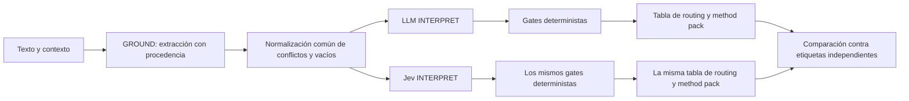

# Jev para pruebas y routing con el dataset v2

**Fecha:** 2026-09-20. **Estado:** análisis y propuesta experimental; no decisión de adopción.
**Alcance:** evaluación ADR-027, 36 casos v2.0.0. No modifica runtime, contratos, gates ni umbrales.

## Recomendación

**Sí: probar Jev como clasificador de INTERPRET y como revisor auxiliar de salidas.**
El mayor encaje inmediato es seleccionar una ruta entre alternativas conocidas. El siguiente
encaje es señalar posibles afirmaciones no sustentadas, siempre contra ejemplos etiquetados.
Para pruebas, Jev es un sistema bajo evaluación o un revisor secundario, no la autoridad que
reescribe las respuestas esperadas del golden dataset.

La integración de evaluación ya existe en `ai-service/harness/jev.py` y en `runner.py --mode jev`.
El README anterior dice «Nada acá está implementado», pero su propia sección posterior y el
código ya incluyen ese brazo. Es experimental; no es el backend productivo de INTERPRET.

| Trabajo | Uso propuesto | Qué demuestra una prueba |
|---|---|---|
| Routing | Choice para `route`, `unit`, `challenge_type`, `horizon`; evaluar `depth` | Acuerdo por dimensión, ruta final y carga de confirmación |
| Tests deterministas | Dobles de respuestas de Jev, errores, abstenciones y límites | Adaptador y gates correctos; no calidad de Jev real |
| Tests live | Mismo estado preparado, LLM interpret frente a Jev interpret | Calidad y latencia de ambos sistemas con ese dataset |
| Revisión semántica | Noul sobre afirmaciones no sustentadas, estimaciones presentadas como hechos | Precision/recall respecto a juicios humanos independientes |
| Revisión del dataset | Detectar desacuerdos que debe adjudicar una persona | Prioridad de revisión; no nueva verdad de producto |
| Extracción y conversación | Mantener el extractor y los agentes generativos | Jev elige opciones, no entrega valores libres ni redacta respuestas |

## Flujo recomendado para experimentar

En una futura adopción, el código conserva autoridad para derivar agente, Step y pack de la
tabla aprobada. Jev propone la clasificación; una probabilidad alta no confirma hechos,
aprueba Steps ni autoriza decisiones organizacionales.

La documentación oficial describe Choice para seleccionar opciones cerradas y devolver la
distribución completa. Su confidence resume la concentración de esa distribución: no equivale
por definición a precisión medida en Starteria. Los umbrales requieren validación del dominio.
Fuentes oficiales verificadas: [Choice](https://docs.typesafe.ai/primitives/choice) y
[Confidence](https://docs.typesafe.ai/confidence). También se contrastaron las copias locales
`docs/jev/choice.md`, `confidence.md`, `score.md` e `intro.md`.

## Evidencia anterior: qué conserva valor

Se encontró el artefacto local `ai-service/harness/eval/out/scorecard.json`, modo `jev`, n=12.
Corresponde a los números publicados en `00-medicion.md` y `01-route-profile-interpret.md`:

| Medida histórica | LLM interpret | Jev interpret |
|---|---:|---:|
| Clasificación estricta, seis casos route | 4/6 | 3/6 |
| Disposición/agente correctos, doce casos | 11/12 | 9/12 |
| Latencia p50 | 16 689.393 ms | 547.701 ms |
| Tokens de salida totales | 19 658 | 5 209 |

La razón de latencias observada es aproximadamente 30.5×; es un resultado de esa corrida.
**No garantiza ese factor en nuevos casos, modelos, cargas, redes o prompts.** La diferencia
de tokens tampoco demuestra por sí sola una reducción equivalente de costo monetario.

Los labels y métricas cambiaron en v2. La comparación anterior no puede reinterpretarse como
un resultado sobre los 36 casos actuales. El artefacto no conserva distribuciones completas,
confianzas por pregunta, prompts/hash de entrada ni gates por caso suficientes para reconstruir
la causalidad de cada fallo. Esta revisión no ejecutó nuevas llamadas de inferencia pagadas.

## Hallazgos que cambian la lectura de los análisis previos

### 1. El umbral que provoca low es 0.50, no 0.75

`jev._confidence_label` usa `min(route_confidence, unit_confidence)`:

- menor que 0.50 → low;
- desde 0.50 hasta antes de 0.75 → medium;
- desde 0.75 → high.

`gates._pred_confidence_low` bloquea low o not_evaluable. **Medium no dispara ese gate.**
Se ejecutó una comprobación sin red sobre `tarea-ligera`, manteniendo las demás condiciones:

| Entrada numérica | Etiqueta | Resultado | Hard gate |
|---:|---|---|---|
| 0.49 | low | confirm | ambiguous_classification |
| 0.50 | medium | route | ninguno |
| 0.74 | medium | route | ninguno |
| 0.75 | high | route | ninguno |

Por tanto, las afirmaciones en 00/01 de que «medium escala al humano porque el corte high
es 0.75» son incorrectas para el código inspeccionado. No hay que bajar 0.75 para intentar
repararlas. Primero hay que conservar las confianzas originales y razones de gates de cada caso.

El scorecard histórico también muestra `plan_coordinate` para `tarea-ligera` y `dependencia-ti`,
frente a sus rutas esperadas originales. No todos los problemas eran abstención. En v2,
`dependencia-ti` se considera provisional: tampoco debe contarse como error inequívoco sin
adjudicación humana. Para readiness el artefacto sí conserva la ruta esperada, pero no suficiente
telemetría para explicar por qué se pidió confirmación.

### 2. Los brazos no siempre reciben el mismo estado preparado

`llm_interpret_arm` ejecuta GROUND con fixture y luego `detect_conflicts()` antes de generar el
mensaje de INTERPRET. `jev_arm` llama a `_interpret_state(case)`, que construye campos desde el
fixture sin aplicar ese procesamiento previo.

Comprobación local sin red: se capturó el mensaje real que el prompt builder genera en el
pipeline y se comparó con `_interpret_state`:

| Caso | Mensajes iguales | LLM contiene conflicting | Jev contiene conflicting |
|---|---|---|---|
| `datos-contradictorios` | no | sí | no |
| `tarea-ligera` | sí | no | no |

El test existente `test_llm_and_jev_arms_share_the_same_state_builder` comprueba que hay un
string y que contiene el input; no compara las dos ejecuciones. **Compartir fixture no basta.**
Antes del siguiente A/B, ambos brazos deben partir de un único estado posterior a GROUND;
un test debe comparar los mensajes preparados en casos conflictivos y con vacíos.

### 3. Las probabilidades se pierden antes del scorecard

`build_route_profile` convierte las respuestas a enums y construye un rationale con algunas
probabilidades redondeadas. `_arm_from` registra la etiqueta agregada de confianza, pero no
la distribución por dimensión. El JSON de evaluación no permite recalibrar offline el umbral
ni construir Brier score/curvas de fiabilidad a partir de esas salidas.

Guardar respuestas originales, modelo realmente respondido, criterios/versiones, entrada
preparada, errores y latencia por intento es requisito de medición. Para Brier usar las
probabilidades de las clases frente a sus etiquetas, no tratar confidence como probabilidad
de acierto. Con pocos casos, reportar también los ejemplos y conteos, sin sobreinterpretar bins.

### 4. Hay criterios de Jev que necesitan reconciliación con la metodología

- `plan_coordinate` dice «Proyecto con deadline», pero OS §10.2 también exige resultado claro.
  El contraste `proyecto-6-meses` / `proyecto-6-meses-acotado` prueba justamente esa diferencia.
- H1/H2/H3 en el adaptador incorporan «retorno cercano/medio/lejano». OS §10.5 define distancia
  en clientes/oferta/capacidades/modelo, no duración. `horizonte-no-es-deadline` es un control.
- Se pregunta Step como Score y se redondea. El promedio entre categorías puede dar un Step
  que no era una alternativa probable; además, CLASSIFY_ROUTE lo sobrescribe desde la tabla.
  Conviene medir perfil previo a gates por separado y derivar el Step operativo en código.
- `depth` como Score también puede promediar extremos. Comparar Choice o conservar la
  distribución para abstención es una hipótesis a probar, no una mejora demostrada.
- `intent` y `unit` tienen descripciones propias en Jev que el prompt LLM no detalla igual.
  El experimento compara sistemas con esas descripciones, no únicamente motores intercambiables.

No asumir que `route = f(intent, unit, challenge_type)` ya está definido. Faltan reglas y
contexto de estado del trabajo. Por ejemplo, los fixtures de `piloto-reconstruct` y
`exploracion-mercado` comparten ese triple y tienen rutas diferentes. Derivar **Step/agente/pack
una vez elegida la ruta** sí tiene una tabla existente; derivar la ruta solo desde ese triple
sería otro cambio de semántica.

### 5. Soft gates continuos no son el primer experimento recomendable

`baseline_estimated`, `unit_inferred` y `horizon_unconfirmed` consultan estados explícitos.
Una vez que esos estados existen, un predicado determinista es adecuado. Reestimar con Jev
si un campo conocido está marcado inferred agrega incertidumbre y costo sin demostrar valor.

Si hay una señal semántica nueva que no se puede extraer de esos estados, probarla como señal
auxiliar y evaluar sus errores. Sustituir pesos/gates por probabilidades cambia la política de
avance y requiere una decisión propia, no se justifica porque el score final admita decimales.

### 6. Revisión semántica sí merece un experimento separado

El caso 09 identifica correctamente que un substring no interpreta negación o paráfrasis.
Pero `run_gate` actualmente anota `prohibited_terms_found` y razones; **no cambia `action` a
RequireConfirmation** por ese hallazgo. La afirmación de que este falso positivo ya interrumpe
al usuario no está sustentada por ese método. Puede afectar métricas u otros consumidores.

Para probar Jev aquí hacen falta pares etiquetados con texto **y evidencia disponible**:
«aún no está validada», «quedó validada» con/sin validación humana y estimación frente a resultado
medido. Dar solo una frase no permite decidir si carece de sustento. Las cuatro frases de 09
no bastan para establecer calidad o un umbral de producción.

## Protocolo concreto para los 36 casos

1. **Congelar versión y etiquetas.** v2.0.0 contiene 33 supported y 3 provisional. Hay 23 casos
   route, de los cuales 20 son supported. Evaluar provisionales aparte; supported tampoco
   significa que ya tengan acuerdo humano independiente.
2. **Corregir primero el instrumento.** Estado posterior a GROUND compartido, respuestas
   originales persistidas y errores conservados como resultados. Separar clasificación
   previa al gate, decisión final y Step sobrescrito por la tabla.
3. **Congelar criterios comparables.** Revisar los criterios contra OS y versionarlos antes
   de medir. No variar modelo, criterios y política de gates al mismo tiempo sin ablations.
4. **Correr `--mode jev`.** Compara LLM INTERPRET frente a Jev INTERPRET con GROUND fijo;
   `--mode deterministic` no mide Jev, y `--mode live` ejecuta extracción real además de
   interpretación. El modo jev actual es un punto de partida, no un instrumento ya corregido.
5. **Guardar y analizar por caso.** Ruta correcta, pack, dimensiones, confirmaciones innecesarias,
   casos que avanzan indebidamente, escalaciones omitidas, errores/timeouts, p50/max, tokens
   y costo cuando exista tarifa verificada. Puntuar acierto condicional y cobertura de routing
   por separado: abstenerse siempre no es una victoria.
6. **Evaluar contrastes.** Solución disfrazada/elegida, diseño/implementación, datos sintéticos/
   sensibles, deadline sin resultado/con resultado, evidencia ausente para investigar y
   horizontes con/sin contexto. Sensibilidad contextual importa más que un promedio aislado.
7. **Calibrar sin contaminar la evaluación.** Separar familias para desarrollo y holdout;
   mantener variantes/paráfrasis de una familia en la misma partición. Si se usan los 36 para
   ajustar criterios/umbrales, pasan a ser desarrollo y hace falta un holdout nuevo. Con 20
   rutas supported, un error mueve cinco puntos: aún no es evidencia robusta de despliegue.
8. **Adopción posterior, si la evidencia la respalda.** Empezar en shadow, medir discrepancias
   con revisión humana y decidir una política explícita para abstenciones/errores. Una
   sustitución productiva de INTERPRET requiere reconciliar ADR-027 y autoridad de la slice.

Los 129 tests anteriores validan regresión del harness. No son 129 observaciones live de Jev.
Esta revisión agregó evidencia mediante dos comprobaciones herméticas puntuales, no una nueva
corrida de modelo ni una afirmación de mejora productiva.

## Referencias de código y frescura

- `ai-service/harness/jev.py`: criterios, `_confidence_label`, `build_route_profile`, `ask`.
- `ai-service/harness/eval/runner.py`: `_interpret_state`, `llm_interpret_arm`, `jev_arm`, `_arm_from`.
- `ai-service/harness/stages/llm_stages.py`: preparación real de GROUND.
- `ai-service/harness/gates.py`: `_pred_confidence_low`.
- `ai-service/harness/stages/deterministic.py`: `run_classify_route`, `run_gate`.
- [Auditoría del dataset v2](../ai-harness/methodology/GOLDEN_DATASET_CALIBRATION.md).
- [Fuente metodológica](../ai-harness/methodology/sources/Starteria_Agent_Methodology_OS_v1.md),
  estado canonical-draft; no se promueve por este análisis.

Graft para orientación y MCP codebase-memory nivel Verify, generación `2026-09-20T15:14:04Z`;
trazas de build_route_profile y cobertura consultada para adaptador, gates, eval y tests. Sin
gaps registrados en esos archivos; verificación directa de fragmentos y experimentos locales
para los hallazgos. El grafo no prueba exhaustividad.
