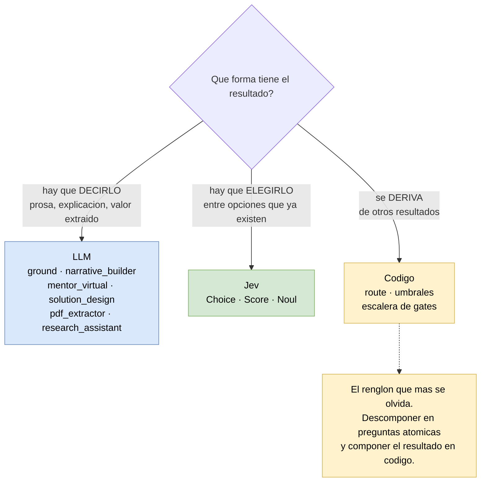

# 99 — Dónde Jev no va

Esta lista importa tanto como los ocho casos. La forma más rápida de desacreditar una
tecnología nueva dentro de un equipo es aplicarla donde no corresponde.

## El límite

Un modelo System One **elige sobre un espacio de respuestas cerrado**. No genera texto, no
produce valores, no explica su razonamiento. Si el output necesita ser redactado o extraído,
Jev no es la herramienta — con o sin buen prompt.

## El árbol de decisión

## Casos descartados explícitamente

| Componente | Por qué no |
|---|---|
| `harness/ground` → `GroundedFieldList` | **Extracción.** Saca valores del texto libre (`value: Any \| None`). Y tiene una regla dura: si el dato no está, emite `status=unknown, value=None` y nunca fabrica. Jev no produce valores |
| `agents/pdf_extractor/` | Extracción estructurada de documentos |
| `agents/narrative_builder.py` | Generación de prosa |
| `agents/mentor_virtual.py` | Conversación abierta |
| `agents/solution_design.py` | Generación de diseño |
| `agents/experiment_coach.py` | Generación de guía |
| `agents/research_assistant.py` | Síntesis de texto |
| `InitialReviewOutput.understandingSummary`, `.critique`, `.strategicQuestions`, `.improvedProposal` | Generación. Solo los dos enums del caso [02](02-initial-reviewer-enums.md) migran |
| `RouteProfile.rationale`, `.conditions_that_would_change` | Texto libre. Ver la decisión B del caso [01](01-route-profile-interpret.md) |
| Hard gates (`critical_unknown`, `contradiction`, `red_line`) | Categóricos por diseño. Un `red_line` no admite un 0.6 |

## El caso limítrofe

`ambiguous_classification` (`methodology.yaml:63`) es un hard gate, así que por la regla de
arriba se queda como está. Pero **su entrada** es `RouteProfile.confidence`, que hoy es
autoreportada por el LLM. Jev no reemplaza ese gate: mejora el número con el que el gate
decide. Es una distinción fina y vale la pena no perderla al implementar.

## La regla general

> Si el resultado tiene que **decirse**, es LLM.
> Si el resultado tiene que **elegirse** entre opciones que ya existen, es Jev.
> Si el resultado se **deriva** de otros resultados, es código.

El tercer renglón es el que más se olvida. Varias de las preguntas que parecen candidatas a
Jev —`route` en el caso [01](01-route-profile-interpret.md) es el ejemplo— se resuelven mejor
como función de otras respuestas que como pregunta propia. La documentación de TypeSafe lo
dice de forma directa: descomponer en preguntas atómicas y componer el resultado en código.
