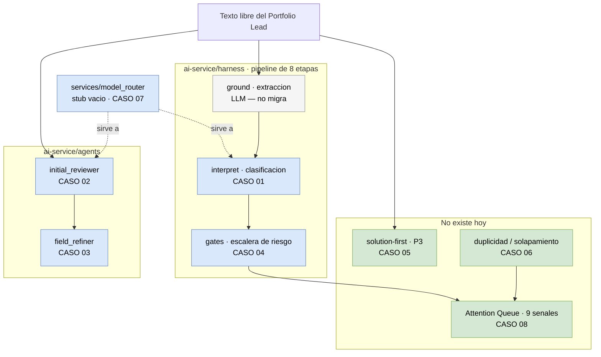

# Análisis — Dónde aplicar Jev en Starteria

> **Activación aprobada — 2026-09-20:** [ADR-031 Accepted](../../backend/docs/adr/ADR-031-confidence-threshold-for-human-escalation.md)
> y [reporte de activación](13-adr-031-activation.md). Jev es el backend por defecto de
> INTERPRET en el harness; GROUND continúa en OpenRouter. El corte 0.50 es provisional.
> El entorno de este checkout no tiene credencial Jev configurada; las llamadas reales
> requieren instalarla en el servicio.

> **Continuación de ADR-031 — 2026-09-20:** [punto de operación de confianza](11-confidence-gate-decision.md).
> Investigación revisada, garantías y límites para 23 rutas y 2 errores. Distingue los pesos del
> corte y registra la discrepancia histórica 11/9 frente a 10/8.
> [Implementación experimental](12-adr-031-implementation.md): separación de confianza de ruta y
> unidad anterior a la activación funcional.

> **Actualización de auditoría — 2026-09-20:** consultar [Jev y dataset v2](10-evaluacion-routing-dataset-v2.md).
> Ya hay 36 casos y un brazo Jev experimental. La revisión corrige la atribución de fallos al
> umbral high, detecta diferencias de preparación de estado entre brazos y distingue resultados
> históricos de conclusiones aún no verificadas. Los casos distintos de INTERPRET siguen
> siendo propuestas, salvo decisión posterior explícita.

**Fecha:** 2026-09-19 · **Estado de los casos siguientes:** propuesta histórica para evaluación;
el caso INTERPRET fue aprobado y activado el 2026-09-20 según ADR-031.
**Alcance:** `ai-service/` · **Contrato de producto:** `doc/STARTERIA_CRAZY8S_E2E_BASE_LOGIC_v0.1.md`
**Corpus de referencia:** `awesome-jev/categories/` (~90 proyectos, 14 categorías)

---

## Qué es esto

Nueve sitios concretos de `ai-service/` donde un modelo System One (Jev) puede sustituir o
complementar una llamada LLM. Cada caso es un archivo independiente con la misma estructura
para que puedan compararse y priorizarse.

Los casos siguientes describen propuestas del 2026-09-19; las auditorías 10 y 11 recogen
el brazo Jev experimental anterior a la decisión. El reporte 13 documenta la activación.
Los `file:line` originales corresponden a esa fecha; las auditorías posteriores precisan el estado.

## El patrón que justifica todo

Los cuatro grupos relevantes del corpus (*agent-decisions*, *verification-guardrails*,
*classification-routing*, *scoring-ranking*) repiten la misma forma:

> Reglas determinísticas resuelven los casos claros primero. Jev decide solo la zona gris.
> Un umbral en código decide si escala a humano. Error o timeout falla seguro.

Eso ya es la forma de `ai-service/harness/gates.py`, cuya escalera es
`Allow → Review → RequireConfirmation → Block`. No hay que reorganizar la arquitectura para
que Jev entre: hay que llenar un hueco que el diseño ya dejó abierto.

## Mapa

Dónde cae cada caso sobre la superficie real de `ai-service/`.

Verde: capacidad nueva, sin superficie de regresion. Azul: reemplaza codigo que hoy
funciona. Gris: descartado — ver [99](99-donde-no-aplica.md).

## Los casos

| # | Caso | Tier | Tipo | Esfuerzo | Riesgo regresión |
|---|---|---|---|---|---|
| [00](00-medicion.md) | **Medición — prerequisito** | — | Instrumento | E1–E9 hechos · corrida live ✅ | Ninguno |
| [01](01-route-profile-interpret.md) | `RouteProfile` en la etapa `interpret` | 1 | Reemplazo | Alto | Alto |
| [02](02-initial-reviewer-enums.md) | Dos enums dentro de `InitialReviewOutput` | 1 | Reemplazo parcial | Medio | Medio |
| [03](03-field-refiner-confidence.md) | `confidence` autoreportado en `field_refiner` | 1 | Reemplazo | Bajo | Bajo |
| [04](04-soft-gates-continuos.md) | Soft gates booleanos → probabilidades | 2 | Reemplazo | Medio | Medio |
| [05](05-solution-first.md) | Detección solution-first (principio P3) | 2 | **Capacidad nueva** | Bajo | **Ninguno** |
| [06](06-duplicidad-solapamiento.md) | `possible_duplicate` / `overlap` | 2 | **Capacidad nueva** | Medio | Ninguno |
| [07](07-model-router.md) | El router que **nadie llama** | 3 | Completar stub | Medio | **Ninguno** |
| [08](08-attention-queue.md) | Las nueve señales de la Attention Queue | 4 | **Capacidad nueva** | Alto | Ninguno |
| [09](09-guardrails-semanticos.md) | Guardrails §19: regla semántica, chequeo por substring | 2 | **Corrige lo existente** | Bajo | Bajo |

Y el negativo, que importa tanto como lo anterior: [99 — dónde Jev no va](99-donde-no-aplica.md).

## Prerequisito: [00 — Medición](00-medicion.md)

Ninguno de los casos se puede evaluar sin instrumento. La suite ya existía
(`ai-service/harness/eval/`) y fue auditada, corregida y extendida — el detalle está en el
documento. Dos conclusiones gobiernan todo lo demás:

- **La suite está saturada en modo determinista.** El brazo `harness` saca 1.0 en cuatro de
  seis métricas porque replaya sus propios fixtures. Jev cambia justamente la capa que ese
  modo stubea, así que **el A/B de Jev solo existe en modo `live`**, que nunca se corrió.
- **La métrica central se calcula sobre seis casos.** Uno solo la mueve 16,7 puntos.

## Cómo leer la tabla

**Tipo** es la dimensión que más debería pesar en la priorización. Un *reemplazo* toca un
camino que hoy funciona y puede romperlo. Una *capacidad nueva* no tiene superficie de
regresión: si sale mal, se apaga y queda como estaba.

**Riesgo de regresión "Ninguno"** no significa que el caso sea trivial — significa que se
puede probar en producción detrás de un flag sin arriesgar lo que ya anda.

## Recomendación de arranque

**Medición primero.** Un spike sin instrumento produce una impresión, no un resultado. Las
tres extensiones de ingeniería a la suite —acuerdo por campo, honestidad de las métricas no
medibles, latencia con scope— **ya están hechas y verificadas**; ver [00](00-medicion.md).

Se hicieron además el precio por modelo (**E8**), la contabilidad de tokens en los dos
caminos de invocación (**E6**, **E9**), el brazo Jev (**E7**) y **la primera corrida live**
(**E5**, 2026-09-20).

**Resultado sobre 23 casos `route` (dataset v2.0.0):** en la dimensión que el clasificador
realmente decide, **`route` empata: 0.913 contra 0.913** — con Jev **26,9× más rápido** y con
**3,9× menos tokens de salida**. Jev además gana en `horizon`. La corrida anterior, con seis
casos, daba a Jev 0,167 *por debajo* en `route`: no era una señal débil, era una respuesta
equivocada.

**Lo que parece pérdida cuelga de un umbral, no del modelo.** El corte operativo
(`_CONFIDENCE_MEDIUM = 0.50`, elegido sin datos) escala 11 de 23 rutas, y 9 no lo
necesitaban. Eso explica la caída de `routing_precision` y `gate_compliance`. Todo en [00 — Medición](00-medicion.md).

**Decisión tomada (2026-09-20): se avanza con Jev en `interpret`.** Lo que queda abierto no es
si clasifica bien, sino **dónde poner el corte de confianza** — cuántas interrupciones a un
humano se toleran para no perder una ruta. Es una decisión de producto, y barrer el umbral
sobre los mismos 23 casos que lo evalúan sería sobreajuste.

Recién entonces los dos spikes, ambos sin superficie de regresión:

- **[07](07-model-router.md)** como spike técnico — prueba la integración punta a punta y mide
  latencia y costo contra el baseline real (`qwen/qwen3.6-flash`, $0.25/$1.50 por 1M tokens).
- **[05](05-solution-first.md)** como spike de producto — capacidad nueva que valida un
  principio que el contrato de producto exige (P3) y que hoy solo existe como instrucción
  dentro de un prompt.

> El caso [07](07-model-router.md) resultó más grande de lo que parecía: `get_model()` es
> código muerto, once agentes hardcodean su modelo, `estimate_cost_usd` cobraba todo a tarifa
> qwen, y el presupuesto acumulaba cero porque nadie le pasaba tokens. **Los tres están
> corregidos** (E8 y E9). El caso 07 ya no tiene bloqueantes técnicos: lo que queda es
> centralizar once hardcodeos, que es trabajo aburrido, no difícil.

Con esos números medidos, el ADR que enmiende al ADR-027 sale con evidencia en vez de
criterios en blanco.

## Advertencia sobre las cifras del corpus

Los números que reportan los proyectos de `awesome-jev` son **autoreportados**, casi nunca
independientes. Los tres más informativos:

- **`wakegate`** es el más honesto: llama a su propio 21/21 *"a smoke test rather than a
  benchmark"*.
- **`jev-axi`** reporta 44/44, pero sobre las 44 llamadas etiquetadas **de su propio repo**.
- **`Abide`** reporta que un revisor independiente confirmó **10 de 39** ediciones marcadas
  (~26% de precisión sin calibrar). Este es el dato que más debería pesar en el caso
  [08](08-attention-queue.md).

Sirven como señal de que el patrón funciona en producción. No sirven como predicción de
nuestra tasa de acierto.

## Gobernanza

`ADR-027` (`backend/docs/adr/ADR-027-methodology-agent-harness.md`) está **`Accepted —
2026-07-24`** y describe el harness tal como existe hoy, incluidas sus dos etapas LLM. Los
casos 01 y 04 cambian lo que ese ADR describe, así que requieren un ADR que lo enmiende antes
de implementarse. Los casos 05, 06, 07 y 08 son aditivos y no lo contradicen.
